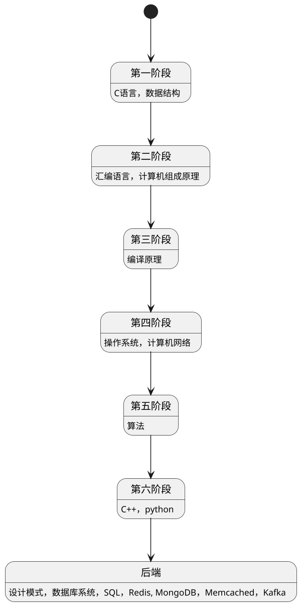

# learn_note
This repo is used to store the notes while reading or learning

## 学习路线

## 书单

- C语言
  - [x] 《C程序设计（第四版）》 -- 谭浩强 
  - [ ] 《The C Programming Language》
  - [ ] 《C缺陷与陷阱》 -- Andrew Koenig
- 数据结构
- 汇编语言
- 计算机系统
  - [ ] 《计算机组成原理》
  - [ ] 《深入理解计算机系统》
- 编译原理
- 操作系统
- 计算机网络
- 算法
- C++
  - [ ] 《C++ Primer 中文版（第5版）》
  - [ ] 《深度探索C++对象模型》 -- Stanley B.Lippman
  - [ ] 《Effective C++ 中文版（第三版）》 -- Scott Meyers
  - [ ] 《C++编程思想》
- Python
- 设计模式
- 数据库系统
- SQL
- Redis
- MongoDB
- Memcached
- Kafka