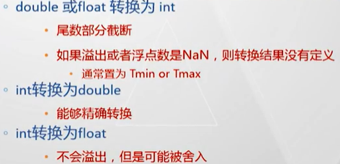

[TOC]

# 数据的二进制表示

---
## C 语言中基本数据类型的大小
> 
> 
> 注：指针类型的大小与处理器有关，与所指向数据的数据类型无关

---
## 整数的二进制表示

### 移位运算
  - 逻辑右移：左侧补0
  - 算数右移：左侧补原来的符号位

> 下述中使用的 `w` 表示字长（32 or 64 bit）

### 无符号数
```math
B2U(X) = \sum_{i=0}^{w-1} x_i \cdot 2^i
```

> 没有符号位，所以一定 >= 0

- 除法
  > - 硬件实现比较复杂，运行效率较低；
  > - 如果除数为 2 的 k 次幂，可以直接`逻辑右移`

### 带符号数


> - 这里使用的是==补码==表示；
> - 符号位是带`权重`的；
> - 对于正数，原码、反码、补码相同
> - 对于负数，其补码为其绝对值的源码按位取反再加 1

---
## 整数的运算

### 补码加法


> 注：由于数据的位宽一致，并且强制转换没有改变数据的二进制表示。而硬件层面无论是否带符号，使用的都是同一个加法器，所以结果不变。

- 补码加法的溢出，两种情况:
  - 两个正数相加，结果为负数
  - 两个负数相加，结果为正数
> 注1：C语言不会对溢出这种情况进行检测
> 注2：通过加一个负数实现减法，所以不需要减法器

### 除法

- 如果除数为 2 的 k 次幂
  - \>= 0 时，同无符号数
  - < 0 时，先在原来的数上加上 2^k - 1，然后进行算数右移


---
## 浮点数的二进制表示

### IEEE 754 浮点数标准


### 浮点数的二进制表示

> 与整数不同，浮点数中的符号位 `s` 仅仅作为符号位使用，不含权重信息


### 浮点数的分类
- 规格化浮点数（Normalized）


- 非规格化浮点数


- 特殊值


### 浮点数表示的性质

- 数轴上的分布


- 以 8 bit 浮点数为例的二进制表示


### 浮点数的舍入（Rounding）

> - 向偶数舍入（Round-To-Even）
>   - 用来避免产生统计误差
>   - 是计算机内默认的舍入方式
>   - 对十进制来说，完成舍入后，最低有效数位应为偶数
>   - 对二进制来说，完成舍入后，最低有效数位应为 0

> 注：0 不需要舍入；1、2、3、4 舍；6、7、8、9 入；5 成双（向偶数舍入）。这样可以保证从统计上来说是无偏的。

---
## C 语言中的浮点数

### 类型转换


> 注1：关键需要记住 int、float、double 的二进制存储格式
> 注2：int 为 32 bit，float 中只有 23 bit 用来控制数据精度，所以，float 能够表示的数值范围大于 int，但是（整数）精度小于 int。