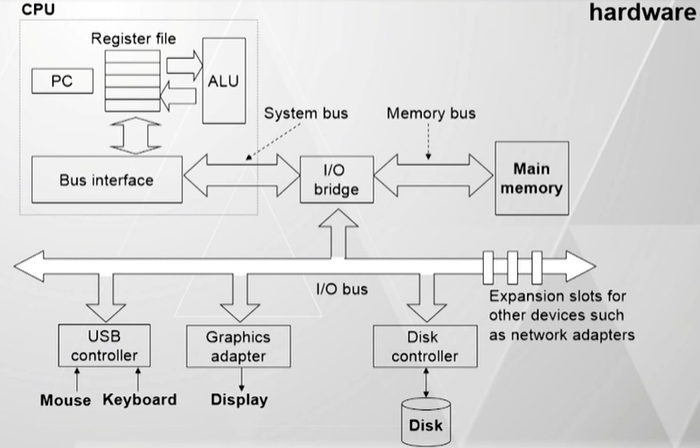
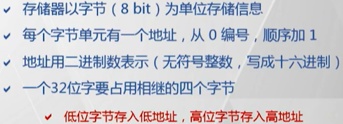

[TOC]

---
# 80X86 计算机组织结构简介

> 注：只是粗略的介绍，有个印象就行

---
## 计算机系统

> 上图只是简单的逻辑示意，与实际使用的物理结构存在差别，参考一下就好。

## 存储器

> 字单元地址用==低位字节==表示
> 注：这里的存储器指的是 80X86 组织结构下的

## 80X86 处理器与保护模式

### 80386 的 3 种工作模式
  - 实模式
    - 操作相当于一个可进行 32 位快速运算的 8086
  - ==保护模式==
    - 是 80x86 设计目标全部达到的工作模式
    - 通过对程序使用的存储区采用==分段、分页的存储管理==机制，达到分级使用、互不干扰的目的
    - 能为每个任务提供一台==虚拟处理器==，使每个任务单独执行，快速切换
  - 虚拟 8086 模式
    - 保护模式下同时模拟多个 8086 处理器

### 32 位微处理器的寄存器

@import "寄存器.md" {line_begin=6 line_end=25}
      
