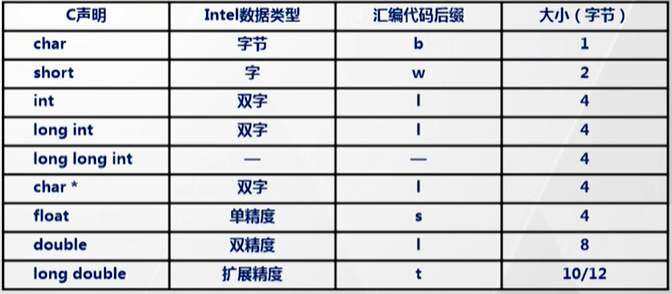
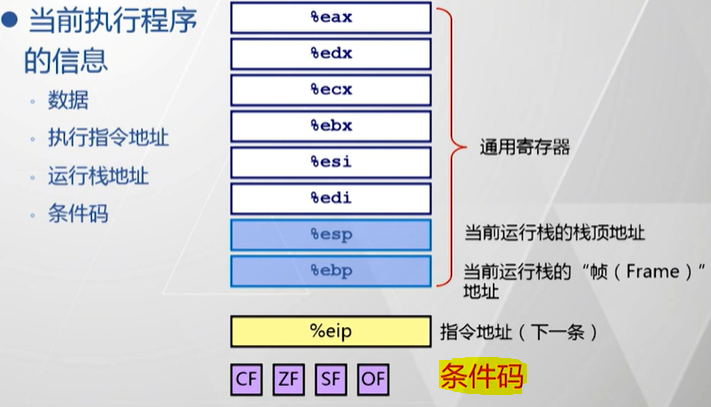

[TOC]

# 80X86 汇编语言与 C 语言

> 从现在开始进入课程主体内容

> ==在汇编程序员眼中，CPU 是独占的，Memory 是连续的==

- AT&T 汇编语言数据格式

- 汇编程序员眼中的系统结构

---
## 汇编指令

### 单操作数指令

@import "基本汇编指令.md" {line_begin=6 line_end=18}

### 双操作数指令

@import "基本汇编指令.md" {line_begin=21 line_end=81}

### 多操作数指令

@import "基本汇编指令.md" {line_begin=84 line_end=90}

---
## [寻址模式](https://blog.csdn.net/zr_lang/article/details/39962261)

@import "七种寻址模式.md" {line_begin=4, line_end=10}

### 七种寻址模式

@import "七种寻址模式.md" {line_begin=13, line_end=40}

### 寻址模式示例

@import "七种寻址模式.md" {line_begin=43 line_end=46}

---
## 条件码

### 四个条件码

@import "条件码.md" {line_begin=6, line_end=11}

### 指令与条件码

@import "条件码.md" {line_begin=14, line_end=32}

### 跳转指令与条件码

@import "条件码.md" {line_begin=35, line_end=39}

### 条件码的读取

@import "条件码.md" {line_begin=42, line_end=45}

---
## 条件码与 C 语言中的控制流

### if 条件执行

### while, do-while, for 循环

@import "控制流.md" {line_begin=13, line_end=15}

### switch 语句

@import "控制流.md" {line_begin=18, line_end=41}

---
## 程序栈

### 程序栈的结构

@import "程序栈.md" {line_begin=9, line_end=12}

### 程序栈的操作

@import "程序栈.md" {line_begin=15, line_end=16}

### 基于程序栈的过程调用

@import "程序栈.md" {line_begin=19, line_end=22}

### 基于栈的编程语言的特点

@import "程序栈.md" {line_begin=25, line_end=34}

### 栈的工作规律

@import "程序栈.md" {line_begin=37, line_end=39}

### 栈帧

@import "程序栈.md" {line_begin=42, line_end=47}

### 寄存器的使用惯例

@import "程序栈.md" {line_begin=50, line_end=63}