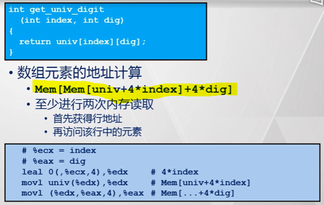
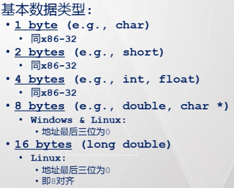
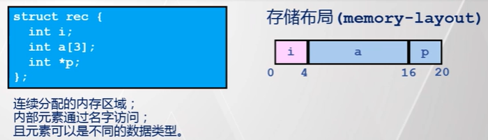

[TOC]

# 数据的存储与访问

---
## 数组的存储与访问

### 数组的存储
### 数组的访问

#### 示例1：使用下标访问
- 

#### 示例2：使用指针访问
  - 

#### 示例3：访问多维数组的行（以 2 维为例）
  - 
  - > 注：根据 leal 指令的特性，需要尽量把比例因子凑成 1、2、4、8

#### 示例4：访问多维数组的某个元素（以 2 维为例）
  - 

#### 示例5：访问指针数组中的某个指针指向的数组
  - 
  - 
  - > 注1：在程序中接连声明的变量，在内存中不一定被分配在连续的内存地址空间中。
  - > 注2：注意把访问这种形式的多维数组与访问上面提到的不包含指针的嵌套数组进行比较(所有数据全部存储在连续的内存空间，并且每一维所占用的内存空间的大小是可以确定的)。

#### 示例6：访问二维数组（编译时大小已知）
  - 
  - > 可以看出，数组应该是被存储在了某个过程实例的栈帧内
  - > 在编译期间就确定了数组各个维度所占内存空间的大小

#### 示例7：访问二维数组（编译时大小未知）
  - 
  - > 从堆中分配动态内存
  - > 在编译期间无法确定数组各个维度所占内存空间的大小，需要在运行过程中根据实际参数进行计算
#### 示例8：访问二维数组的优化
  - 编译时大小已知
    - 
  - 编译时大小未知
    - 
    
---
## 结构的存储与访问

### 基本数据类型存储位置的对齐
- 对齐的一般原则
  - 已知某种基本数据类型的大小为 K 字节
  - 那么，该类型的数据存储地址的起始地址与所占地址空间的长度必须是 ==K== 的整数倍（不同操作系统的要求略有不同）
- 对齐的原因
  - 数据在内存中以块为单位进行存储
  - 对齐后，可以确保一个数据肯定位于同一个内存块中
  - 如果不对齐，当访问一个数据时可能会牵涉多个内存块，导致访存效率变低
- 只有在编写汇编程序时才需要考虑对齐；使用高级语言编程时，对齐是编译器的工作
- 不同类型元素的对其要求
  - X86-32
    - 
  - X86-64
    - 
    
### 结构的存储对齐
- 对齐的一般原则
  - 必须满足结构中各个元素的对齐要求
  - 结构自身的对齐要求等同于其各个元素中对齐要求最高（大）的那个，设为 K 字节，即结构的起始地址与结构所占地址空间的长度必须是 K 的整数倍
    - > 感觉对结构的长度进行限制的原因在于提高结构数组的访问效率
- > 为了节省内存空间，在声明结构中的元素时，应该先声明要求高的元素

#### 示例1：访问 4 字节对齐结构中的元素
- 待访问结构的定义
  - 
- 访问首个元素
  - 
- 访问结构中的数组中的元素
  - 
- 变态一下
  - 

#### 示例2：访问结构数组中的结构中的元素
  - 

---
## 联合

### 联合的存储
  - 
