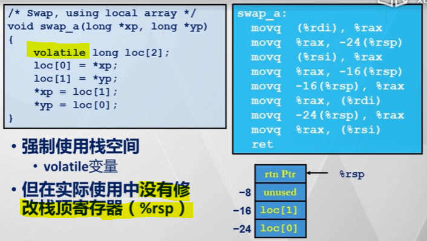

[TOC]

# 80X86-64

---
## X86-64 的寄存器和函数传参

### X86-64 的寄存器

> 为了兼容 32 位程序，蓝色中标出的是只使用寄存器中的低 32 位
> 除了 %rsp，其余寄存器都是通用寄存器

### X86-64 下的函数传参
- 当参数少于 7 个时，参数==从左到右==放入寄存器 rdi, rsi, rdx, rcx, r8, r9
- 当参数为 7 个及以上时，前 6 个同上，后面的依次 “从右到左” 放入内存栈中
- > 编译器这样做的原因在于充分利用寄存器，从而提高程序执行效率

---
## X86-64 的条件码

#### X86-64 下读取条件码

> - 虽然 xorl %eax, %eax 看起来只是把 %rax 的低 32 位清零了，但是 64 位处理器在设计的时候，32 位的指令的运行结果会自动 0 扩展到整个寄存器
> - 这样做的目的在于减少指令的数据相关，提高流水线效率

#### X86-64 跳转指令与条件码

- 示例
> 

> 注1: cmovle 是条件传送指令
> 注2: 编译器具体是否使用条件传送指令与处理器的位数无关, 而是需要根据处理器支持的指令集进行选择

---
## X86-64 的过程调用

### X86-64 寄存器使用惯例
> 
> 注1：callee 表示被调用者
> 注2：在 X86-64 模式下，%rbp 调整为通用寄存器；%rsp 仍然为栈顶寄存器，在硬件上需要特殊设计，call、ret 指令会直接操作该寄存器

### 示例：swap 函数
- 
- > 注：允许这样做的原因在于在 x86-64 架构下，从 %rsp 开始向下的 128 字节可以直接由当前的过程实例使用，而无需被显式包含到栈帧中

### 示例：函数==栈帧==的使用
- 
- > 注：根据这个示例，可以看出无需分配即可使用的 128 会改变栈帧的使用方式。同时，可以猜测之所以是 128 字节，原因在于最多需要有 16 个寄存器的值需要通过栈帧备份与恢复。
