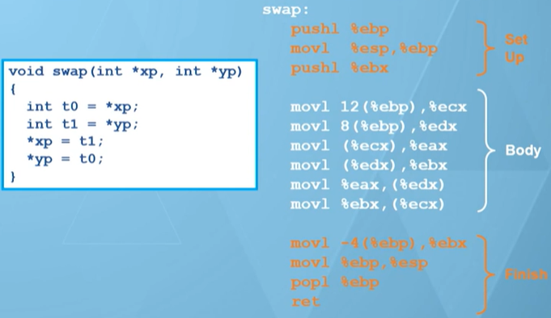

[TOC]

# 80x86 的七种寻址模式

> 统一格式：地址或偏移 (%基址或偏移量寄存器, %索引寄存器, 比例因子)
> - 基址寄存器 Rb：8 个通用寄存器之一
> - 索引寄存器 Ri
>   - %esp 不能作为索引寄存器
>   - %ebp 一般也不用做索引寄存器
> - 比例因子：1，2，4，or 8

## 寻址模式

- 立即数寻址
  - 数据作为指令的一部分
  - movl $0x1122, %eax

- 寄存器寻址
  - 数据存储在寄存器中
  - movl %ebx, %eax

- 直接寻址
  - 在指令中直接给出数据所在的内存地址
  - movl 0x3344, %eax

- 寄存器间接寻址
  - 在指令中通过寄存器给出数据所在的内存地址
  - movl (%edx), %eax

- 寄存器相对寻址
  - 在指令中通过寄存器和偏移量给出数据所在的内存地址
  - movl 4(%eax), %ebx

- 基址变址寻址
  - 在指令中通过基址寄存器和变址寄存器给出数据所在的内存地址
  - movl (, %eax, 4), %ebx

- 基址变址相对寻址
  - 在指令中通过基址寄存器、变址寄存器和偏移量给出数据所在的内存地址
  - movl 0x1122(, %eax, 4), %ebx

## 寻址模式示例

> 对 C 语言来说，栈中从高地址到低地址依次是 yp, xp, return address