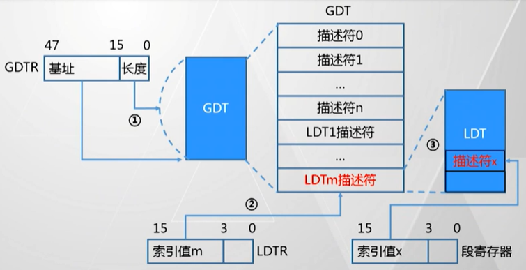

[TOC]

# 寄存器

## X86-32 的寄存器

- 8 个 32 位通用寄存器
  - eax, edx, ecx, ebx, esi, edi
  - esp: 栈顶
  - ebp：栈底
- 1 个 32 位指令寄存器
  - eip
- 6 个==16 位==段寄存器
  - CS, DS, SS, ES, FS, GS
  - > ==高 13 位==代表内存段的编号，指的使描述符在描述符表中的索引
  - > ==低 2 位==用来表示特权级别
  - 用来实现基于 ==段模式== 的虚拟存储器
  - 一个物理内存地址由 ==段基地址== 和 ==偏移地址== 两个要素构成
  - GDT 与 LDT
    - GDT：全局描述符表
      - 存放操作系统和各个任务公用的描述符
      - GDT Register (GDTR)：存放 GDT 的起始地址
    - LDT：局部描述符表
      - 存放各个任务的私有描述符
    - 

## X86-64 的寄存器

@import "80x86-64.md" {line_begin=9, line_end=12}