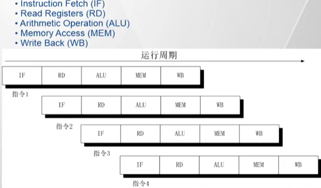
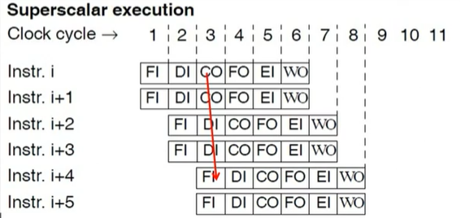

[TOC]

---
# 微体系结构背景

## 处理器流水线 (以五级流水示例)

## 现代通用处理器: 支持深度流水线以及多发射结构
- 深度流水线: 流水线的阶段比较多 (通常小于 20)
- 多发射结构: 多条流水线, 同一 CPU 周期可以取多条指令

> 在流水线微体系结构下: 
> 条件跳转指令会引起一定的性能损失
> 条件传送指令与条件跳转指令相比要好一些, 但是仍然存在局限性

## 分支预测技术 (Branch Prediction)
- 方案1: 使用上一次的实际跳转结果作为本次的预测结果
  - 导致了编译器从 do-while 到 jump to middle 的变化
  - 这样做可以节省预测表的使用, 从而使得预测表可以记录更多的历史信息, 从而提高程序整体的分支预测准确度
- 方案2: 采用了循环预测技术, 即在循环时, 总是预测为真
  - 导致了编译器从 jump to middle 改回 do-while 的变化