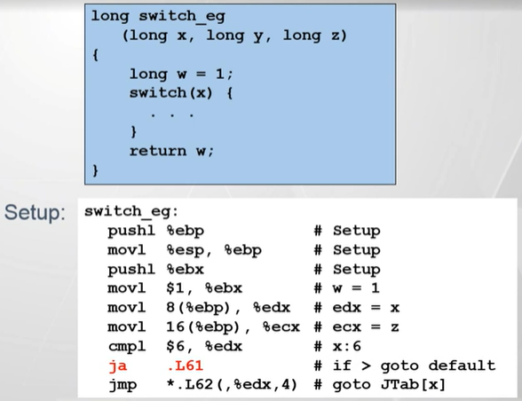
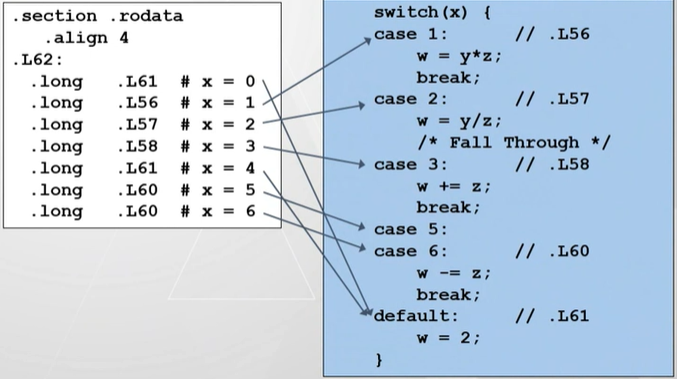
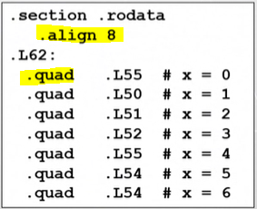

[TOC]

---
# 控制流

> 实现上就是使用汇编语言中的条件执行相关的指令

## if

(略)

## while, do-while, for

> 编译器先把上述形式的循环全部转换为 do-while 形式, 然后再生成对应的汇编代码
> 编译器选择 do-while 形式的原因与 CPU 的[微体系结构](./微体系结构.md)有关

## switch

- 基于 jump table 的实现
  - jump table 中的各个条目是每个 case 对应的代码段的入口地址
  - 适合用于每个 case 条件都比较接近的情况, 例如 case 1:, case 2:, case 3:, case 5: 

> 示例:
> 
> 其中, jmp *.L62(, %edx, 4) 的解读方式:
> - .L62 是 jump talbe 的起始地址
> - %edx 中存储的是 x, 在实现 jump table 的时候被作为 index
> - 4 是比例因子, 因为 jump table 中每个条目需要 4 个字节
> - "*" 表示把上述结果的值作为一个地址, 即直接跳转到这个地址

> jump table 表结构:
> - 每个表项 (即跳转地址) 占 4 个字节
> - 基地址是 .L62
> - 表项的内容 (X86-32):
> 
> - 表项的内容 (X86-64):
> 

- 基于 if-then-else 的实现
  - 适合用于每个 case 条件相差比较大的情况, 例如 case 100:, case 200:, case 300:
  - 编译器在把 switch 转换为 if-then-else 的过程中, 使用二叉树的结构进行组织, 从而可以提高性能

