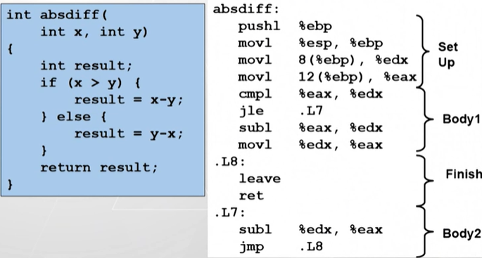

[TOC]

# 条件码

## 四个条件码

> - CF (Carry Flag): 进位标志
> - SF (Sign Flag)：符号标志
> - ZF (Zero Flag)：0 标志
> - OF (Overflow Flag)：溢出标志
> 条件码用来记录一条指令执行完成后的状态

## 指令与条件码

- addl 指令与条件码
  - CF: 可以用来检测 ==无符号数加法== 运算结果是否溢出
  - OF: 可以用来检测 ==带符号数加法== 运算结果是否溢出

- cmpl 指令与条件码
  - 格式：cmpl b, a
  - 说明：计算 a - b 的值（但是不改变目的操作数）
    - if a - b == 0, set ZF
    - if a - b < 0, set SF
    - if a - b overflow, set OF 
    - if 借位， set CF

- testl 指令与条件码
  - 格式：test b, a
  - 说明：计算 a & b 的值（但是不改变目的操作数）
    - if a & b == 0, set ZF
    - if a & b < 0, set SF
  > test 指令会使 CF、OF 为 0

## 跳转指令与条件码

- 示例
> 

## 条件码的读取

> 注意上表中的部分指令是区分无符号和带符号数