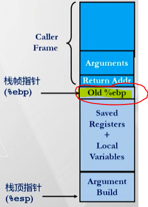

[TOC]

---
# 程序栈

> 这部分内容很关键

## 程序栈的结构

- 符合 “栈” 工作原理的一块内存区域
- 从 ==高地址向低地址== 增长
- ==%esp== 寄存器存储栈顶地址

## 程序栈的操作

@import "基本汇编指令.md" {line_begin=101, line_end=115}

## 基于程序栈的过程调用

- > 利用栈来支持函数过程的调用与返回

@import "基本汇编指令.md" {line_begin=118, line_end=127}

## 基于栈的编程语言的特点

- 支持递归
  - 例如：C, Pascal, Java
- 代码是可重入的（Reentrant）
  - 同时有同一个过程的多个实例在运行
  - 每个实例都需要一块区域（也叫==栈帧==）来存储每个过程实例的数据
    - 参数
    - 局部变量
    - 返回地址
    - > 注：没有全局变量

## 栈的工作规律

- 栈的生命周期与过程实例的生命周期一致
- 后进先出

## ==栈帧==

- 每个过程实例都有一个栈帧
- %ebp 指向栈帧的==栈底==
- %esp 指向栈帧的==栈顶==
- 栈帧中的内容：
  - 

## 寄存器的使用惯例

- 将通用寄存器分为两类
  - 由调用函数进行保存
    - %eax
    - %edx
    - %ecx
  - 由被调用函数进行保存
    - %ebx
    - %esi
    - %edi
  - 两个特殊的寄存器
    - %esp
    - %ebp
- > 注：约定该惯例的目的在于提高程序的效率