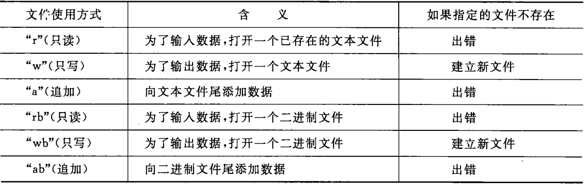
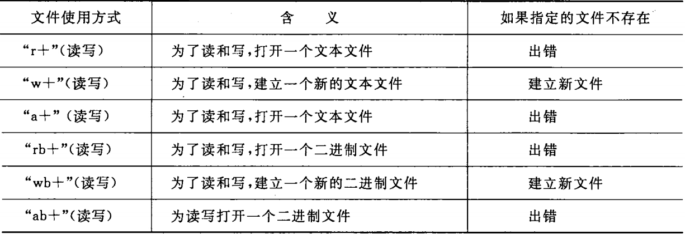
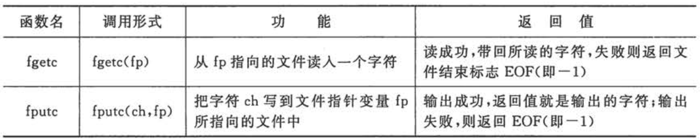
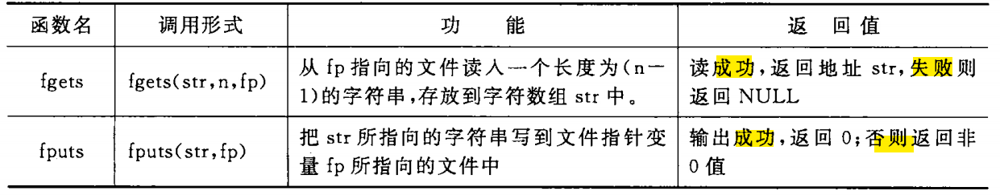

[TOC]

# 第10章 对文件的输入输出

> 本章只介绍一些最基本的概念。

---
## 10.1 C文件的有关基本知识

### 10.1.1 什么是文件

- 程序设计中主要用到的两种文件
  - 程序文件
    - 文件内容：程序代码
    - 包括：源程序文件（.c），目标文件（.obj），可执行文件（.exe）
  - 数据文件
    - 文件内容：供程序运行时读写的数据。

> 本章主要介绍数据文件。
> 操作系统把各种设备统一作为文件来处理，好处：
>  - 简化用户对输入输出设备的操作；
>  - 用户不必区分各种输入输出设备之间的区别。

- 文件管理：
  - **操作系统**以文件为单位对数据进行管理
    - （数据）文件：存储在外部介质上数据的集合。
  - 文件的输入输出
    - 文件输入（读取）：
      - 按==文件名==找到所指定的文件；
      - 从文件中读取数据。
    - 文件输出（存储）：
      - 建立指定文件名的文件；
      - 向该文件中输出数据。
    > - 从 C 程序的观点来看
    >   - 作为输入输出的各种==文件或设备==都是统一以==逻辑数据流==（字符流或二进制字节流）的方式出现的（无论程序一次读写一个字符、一行文字、一个指定的数据区）;
    >   - 数据文件由一连串的字符（或二进制字节）组成
    >     - 不考虑行的界限；
    >     - 两行数据之间不会自动加分隔符；
    >     - 对文件的存取以字符（或二进制字节）为单位。
    >   - 输入输出数据流的开始和结束仅受程序控制，而不受物理符号（如回车换行符）控制（可以增加处理的灵活性）。

### 10.1.2 文件名

- 文件名（又称文件标识）
  - 组成：
    - 文件路径
    - 文件名主干
    - 文件后缀

### 10.1.3 文件的分类

- 数据文件的分类（根据数据的组织形式划分），包括
  - ASCII 文件（又称文本文件）：每个字节存放一个字符的 ASCII 代码
  - 二进制文件（又称映像文件）：以二进制形式存储（与内存中数据的存储形式相同）

- 数据在磁盘上的存储
  - ASCII 存储形式
    - 可存储的数据类型：字符型数据、数值型数据
      - 例如：10000，需要5个字节（一个字节存储一个字符，字节与字符一一对应）
    - 优点：便于对字符进行逐个处理；
    - 缺点：占用存储空间较多，需要花费转换时间（二进制形式与 ASCII 码之间的转换）
  - 二进制存储形式：
    - 可存储的数据类型：数值型数据
    - 优点：节省存储空间和转换时间。

### 10.1.4 文件缓冲区

- 工作原理：
  - 系统自动自动地在**内存区**为每个正在使用的文件开辟一个**文件缓冲区**；
  - 从内存向磁盘输出数据时：
    - 先把数据送到内存的缓冲区；
    - ==缓冲区满==后才一起送到磁盘。
  - 从磁盘向内存读取数据时：
    - 一次从磁盘将一批数据读入内存缓冲区（充满缓冲区）；
    - 再从缓冲区==逐个地==将数据送到程序数据区（给程序变量）。
  > - 缓冲区的大小由各个具体的==C 编译系统==确定

### 10.1.5 文件类型指针

- 作用：
  - 用来定位与之关联的文件；
- 原理：
  - 指向内存中文件信息区的开头；
    - 文件信息保存在由==系统声明==的==类型为FILE==的结构体变量中；
    - 文件信息区用来存放文件的有关信息（文件名、状态、当前位置等）；
    - 文件信息区中的内容由操作系统在打开文件时自动放入（用户无需过问）。

---
## 10.2 打开与关闭文件
    
### 10.2.1 用fopen函数打开数据文件

- 原理：根据文件名和文件使用方式为文件建立相应的信息去和缓冲区；
- 函数调用方式：fopen(文件名, 使用文件方式);
  - 返回值：文件指针；
    - ==如果失败==，则返回一个空指针 NULL。
  - 示例：FILE * fp = fopen("./a1.txt", "r");
  - 使用文件方式:
    
    
- 注：
  - 从 ASCII 文件输入时，遇到回车换行符，系统把它转换为一个换行符；输出时，把换行符转换为回车和换行两个字符；
  - 从二进制文件输入、输出时，不会进行上述转换操作（直接按照内存中的数据形式进行输入、输出）；
  - 三个标准流文件（程序开始运行时由系统自动打开）
    - 标准输入流（stdin）
    - 标准输出流（stdout）
    - 标准出错输出流（stderr）

### 10.2.2 用fclose函数关闭数据文件

- 原理：将缓冲区中剩余的信息写入文件，然后撤销文件信息区和文件缓冲区；
- 函数调用方式：fclose(文件指针);
  - 返回值：成功返回 0；失败返回 EOF(-1)；
- 注：
  - 如果不关闭文件可能会丢失数据（只写入缓冲区，还没有写到文件中）；
  - 有些编译系统在程序结束前会自动先将缓冲区中的数据写到文件（实际编程时不能做这个假设）。

---
## 10.3 顺序读写数据文件

> 文件打开之后，才能对其进行读写。
> 对顺序读写来说，对文件读写数据的顺序和数据在文件中的物理顺序是一致的。
> 顺序读写需要调用库函数。

### 10.3.1 怎样向文件读写字符

- 函数调用方式：
  
- [例10.1](./examples/10.1.c)
- [例10.2](./examples/10.2.c)

### 10.3.2 怎样向文件读写一个字符串

- 函数调用方式
  
  - 注：
    - fgets 自动在读入的字符串末尾添加一个 '\0' 字符；
    - fgets 在读完 n-1 个字符之前如果遇到换行符 '\n' 或文件结束符 EOF，则立即结束读入过程
      - 遇到的换行符会作为一个字符被读入;
    - fputs 不输出字符串末尾的 '\0'。
- [例10.3](./examples/10.3.c)

### 10.3.3 用格式化的方式读写文件

- 读入文件
  - 函数调用方式：fscanf(文件指针，格式字符串，输入表列);
- 输出文件
  - 函数调用方式：fprintf(文件指针，格式字符串，输出表列);
- 注：
  - 函数 fprintf 和 fscanf 与 printf 和 scanf 相仿；
    - 只有一个不同点：输入、输出的终端不一样。
  - fprintf 在输出时，需要把二进制形式转换成字符型；fscanf 在输入时需要把字符型转换为二进制型
    - 因此，在内存频繁与磁盘交换数据的时候，效率比较低。

### 10.3.4 用二进制方式向文件读写一组数据

- 读入文件
  - 函数调用方式：fread(buffer, size, count, fp);
  - 参数解释：
    - buffer: 用来存放从文件读入的数据的内存首地址；
    - size: 要读取的数据项的大小（字节数）；
    - count: 要读取的数据项的个数（每个数据项长度为 size）；
    - fp: 文件指针。
  - 返回值：实际读入的数据项的个数。
- 输出文件
  - 函数调用方式：fwrite(buffer, size, count, fp);
  - 参数解释：
    - buffer: 用来存放输出数据的存储区的首地址；
    - size: 略；
    - count：略；
    - fp：略。
  - 返回值：实际输出的数据项的个数。
- [例10.4](./examples/10.4.c)

---
## 10.4 随机读写数据文件

> 随机读写可以对任何位置上的数据进行访问。

### 10.4.1 文件位置标记及其定位

- 文件位置标记
  - 作用：指示“==接下来==要读写的下一个字符的位置”。
  > - 可见，对于顺序读写来说，读写函数自动修改了文件位置标志的值。
- 文件位置标记的定位
  - rewind 函数
    - 作用：是文件位置标记指向文件开头
    - 调用方式：rewind(文件指针);
    - 返回值：没有返回值
    - [例10.5](./examples/10.5.c)
  - fseek 函数
    - 调用方式：fseek(文件指针，位移量，起始点)
    - 参数解释：
      - 文件指针：略；
      - 位移量：long 型数据，以“起始点”为基点，向前移动的==字节数==；
      - 起始点：用 0，1，2 代替
        - 0（SEEK_SET）：文件开始位置；
        - 1（SEEK_CUR）：文件当前位置；
        - 2（SEEK_END）:文件末尾位置。
        > - 括号中为 C 标准为起始点指定的名字。
  - ftell 函数
    - 作用：测定文件位置标记的当前位置
    - 调用方式：ftell(文件指针);
    - 返回值：文件位置标记的当前位置（用相对于文件开始位置的位移量表示，单位字节）
      - 如果出错，返回值为 -1L。

### 10.4.2 随机读写

- [例10.6](./examples/10.6.c)

---
## 10.5 文件读写的出错检测

> C 提供一些函数用来检查输入、输出函数调用可能出现的错误。

- ferror 函数
  - 作用：检查各种输入输出函数（如 putc, getc, fread, fwrite 等）是否出现错误。
  - 调用形式：ferror(文件指针);
  - 返回值：0，表示没有检查到错误；非零，表示检查到错误。
  > - 注：
  >   - 对同一个文件==每一次调用输入、输出函数==，都会产生一个新的 ferror 函数值。因此，每一次调用输入、输出函数之后，应该立即检查 ferror 函数的值（否则信息会丢失）；
  >   - ==fopen 函数==会把 ferror 的初始值自动置为 0。
- clearerr 函数
  - 作用：使==文件错误标志==和==文件结束标志==置为 0。
  - 注：只要出现文件读写错误标志，它就==一致保留，直到对同一文件调用 clearerr 函数或 rewind 函数，或任何其他一个输入输出函数==。