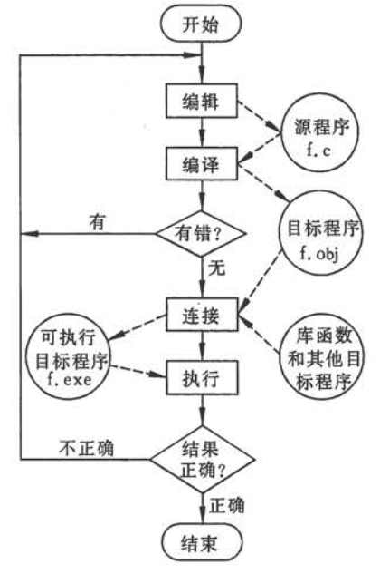

[TOC]

> 背景: 
> - 参考书为 《C程序设计（第四版）》 -- 谭浩强 著，对应的[视频课程链接](https://www.bilibili.com/video/av2831981?from=search&seid=10262807765628885613)
> - C 语言功能丰富、表达能力强、使用灵活方便、应用面广、目标程序效率高、可移植性好，既具有高级语言的优点，又具有低级语言的许多特点，既适合编写系统软件，又能方便地用来编写应用软件。
> - C++ 是为处理较大规模的程序开发而研制的大型语言，它比 C 语言复杂得多，难学得多。
> - 学习的是 C 99 标准，该标准适应了 C 语言的发展，使程序更加规范（大多数教材是 C 89 标准）。 C 99 标准中增加的部分新的功能和规则，是用来提高编写比较复杂的程序时的效率的。
> - 本次使用的参考书，只讲解基础，并不会完整介绍 C 99 标准。
> - 《The C Programming Language》 -- C 语言==圣经==。
> - C 是==面向过程==的程序设计语言，常见的还有==面向对象==和==函数式编程==等。

# 第1章 程序设计和C语言

---
## 1.1 什么是计算机程序

> ==程序==就是**一组**计算机能识别和执行的==指令==。
> ==汇编指令==是处理器所具备的功能的接口，高级语言需要被转换为汇编指令才能被处理器所执行。

---
## 1.2 什么是计算机语言

- 计算机语言
  - 作用：人和计算机进行交流的接口--指导计算机完成特定工作。
  - 发展历程
    - 机器语言：本质就是二进制数据
      - > 如果需要了解机器语言如何被处理器执行，那么就需要学习**数字电路**相关知识了。这是计算机硬件设计从业人员需要了解的内容，软件工程师不必过于关注。但是，如果需要了解计算机的工作原理，可以参考《计算机组成原理》，从而对计算机硬件组成以及各个硬件之间的协作关系有个大概了解。
    - 汇编语言（又称符号语言、符号汇编语言）：本质上是机器语言的助记符
      - > 因为汇编语言是处理器功能的接口，因此汇编语言是依赖于具体硬件的。
    - 高级语言
      - > 除了汇编程序员，其他程序员往往使用的都是高级语言。高级语言不直接依赖于具体硬件，而依赖于编译器或解释器。编译器或解释器可以起到==翻译==高级语言的作用，因此一种高级语言就对应一个编译器或解释器，并且编译器或解释器在翻译高级语言的时候，还需要知道具体的硬件类型。

- 高级语言的发展历程
  - 非结构化的语言
    - 特点：基于过程，可以随意跳转，不易维护
    - 举例：BASIC, FORTRAN, ALGOL
  - 结构化的语言
    - 特点：基于过程，不允许随意跳转，易于维护
    - 基本结构：顺序结构、分支结构、循环结构
  - 面向对象的语言
    - 特点：面向对象，适合处理大规模问题

---
## 1.3 C语言的发展及其特点

> - 开发 C 语言的目的在于尽可能降低用它所写的软件对硬件平台的依赖程度，使之具有可移植性。
> - 不同软件公司所提供的一些 C 语言编译系统并未完全实现 C 99 建议的功能，它们多以 C 89 为基础开发。 

- C 语言的主要特点
  - 语言简洁、紧凑，使用方便、灵活
    - [37 个关键字](./补充_C语言中的关键字.md)
    - 9 种控制语句
    - > C 语言不直接提供输入和输出语句、有关文件操作的语句和动态内存管理的语句等（这些操作是==由编译系统所系统的库函数来实现==的。也就是说，很多功能是通过==库函数==的形式实现的。），C 的编译系统相当简洁。
  - 运算符丰富
    - [34 种运算符](./补充_运算符的优先级和结合性.md);
    - 括号，赋值，强制类型转换等均作为运算符处理。
  - 数据结构类型丰富
    - 整型、浮点型、字符型、指针类型
    - 数组类型、结构体类型、共用体类型
    - 超长整型（long long)、布尔类型（bool）
    - 复数浮点类型
  - 具有结构化的控制语句
    - if ... else
    - while
    - do ... while
    - switch
    - for
    - > ==函数==是程序的模块单位。
  - 语法限制不太严格，程序设计自由度大
    - 对数组下标越界不进行检查
    - 变量的类型使用比较灵活（整型、字符型、逻辑型数据可以通用）
  - 允许直接访问物理地址
    - 能够进行位操作
    - 能实现汇编语言的大部分功能
    - 可以直接操作硬件
  - 程序的可移植性好
    - C 的==编译系统==相当简洁，所以每种类型的==处理器==，基本上都有一个与之对应的 C 编译器；C 的==标准链接库==是用可移植的 C 语言写的，因此 C 编译系统在新的系统上运行时，可以直接编译 “标准链接库” 中的大部分功能，而不需要修改源代码。综上，C 程序的可移植性要好很多。
    - > 与之相对，汇编语言是硬件的结构，与硬件平台相关，所以可移植性比较差。
  - 生成的目标代码质量高
    - 程序执行效率高

## 1.4 最简单的C语言程序

### 1.4.1 最简单的C语言程序举例
- [例1.1](./examples/1.1.c)
- [例1.2](./examples/1.2.c)
- [例1.3](./examples/1.3.c)

### 1.4.2 [C语言程序的结构](./补充_C程序的结构.md)

- 一个程序由一个或多个源文件组成
  - 源文件
    - 一个源文件就是一个程序模块，源文件将程序分成若干个程序模块。
    - 以源文件为单位进行编译。经过编译，每个源文件会得到一个对应的目标文件。将目标文件链接在一起得到二进制的可执行程序。
- 源文件的组成
  - 预处理指令（例如 #include, #define等）;
  - 全局声明
    - 全局变量：在函数外面声明的变量;
    - 局部变量：在函数内部声明的变量。
  - 函数定义
- 函数是 C 程序的主要组成部分
  - 一个函数用来实现一个或几个特定的功能
  - 一个程序==必须且仅包含一个 main 函数==
- 函数的组成
  - 函数首部
    - 一般形式：返回值类型 函数名 (参数类型1 参数名1, ... 参数类型n 参数名n)
    - 示例：int max (int x, int y)
  - 函数体: 由花括号括起来的部分
    - 声明部分：本函数所用到的局部变量；本函数所调用的函数。
    - 执行部分：若干语句，用来实现函数的功能。
- 程序总是从 main 函数开始执行
  - 与 main 函数在整个程序中的位置无关
- 程序中对计算机的操作是由函数中的 C 语句完成的
  - > 这些 C 语句位于 C 的标准链接库中
- 每个数据声明和语句的最后必须有一个分号
- C 语言本身不提供输入和输出语句
  - 由库函数提供，从而使得 C 语言更便于移植
- 程序应当包含适当的注释

## 1.5 运行C程序的步骤与方法

> - 不同系统，例如 windows 和 linux 生成的目标程序有所区别
> - 可以通过命令行调用编译器对源文件进行编译和链接
> - 也可以使用 IDE 对源文件进行编译和链接

## 1.6 程序设计的任务

- 从确定问题到完成任务，一般经历以下几个工作阶段
  - 问题分析
  - 设计算法
  - 编写程序
  - 对源程序进行编辑、编译、链接
  - 运行程序，分析结果
  - 编写程序文档