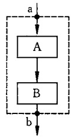
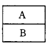
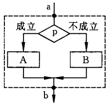
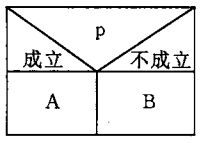
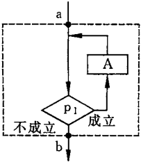
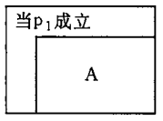
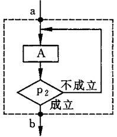
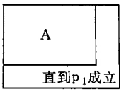
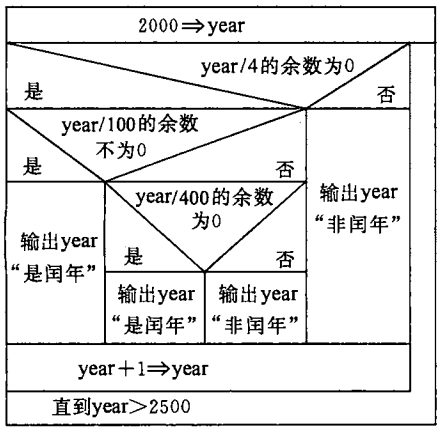
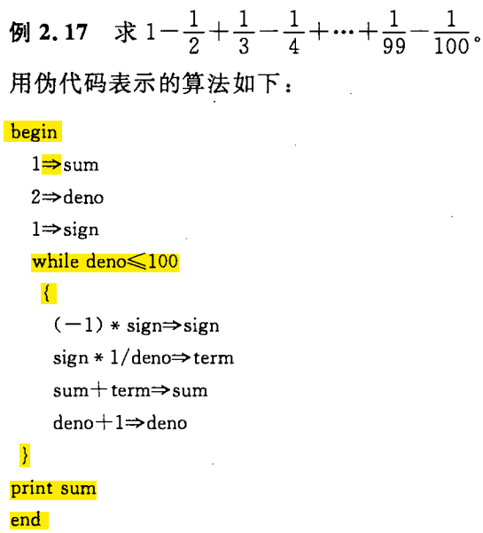

[TOC]

# 第2章 算法--程序的灵魂

> 程序 = 数据结构 + 算法
> - 该公式适用于过程化程序;
> - 数据结构：指定用到哪些数据，以及这些数据的类型和数据的组织形式;
> - 算法：要求计算机进行操作的步骤。

---
## 2.1 什么是算法

- 算法：解决问题的步骤。
- 计算机算法：计算机能够执行的算法，可以分为以下两类
  - 数值运算算法
    - 目的：求数值解（例如方程的根、函数的定积分等）；
    - 现状：往往有现成的模型，可以运用数值分析方法，研究比较深入，算法成熟，有各种库可用。
  - 非数值运算算法
    - 目的：应用范围十分广泛（例如图书检索、人事管理等）
    - 现状：只有一些典型的运算有现成的算法可用。

---
## 2.2 简单的算法举例

（本节提出了几个简单的问题，并描述了解题思路 -- 即算法，故略）

---
## 2.3 算法的特性

- **有穷性**：一个算法的操作步骤是有限的；
- **确定性**：算法中的每一个步骤都应当是确定的，而不是含糊、模棱两可的；
- **有零个或多个输入**：输入指的是执行算法时需要从外部取得必要的信息；
- **有一个或多个输出**：算法的目的是为了求解，没有输出的算法没有意义；
- **有效性**：算法中的每一个步骤都应当有效地执行，并得到确定的结果。

> 如果使用的是别人编写好的算法，那么该算法就是一个“黑箱子”。使用时，无需了解算法的具体实现步骤，而只需要从外部特征上了解该算法的使用方法即可。

---
## 2.4 怎样表示一个算法

- 表示算法的常用方法
  - 自然语言
    - 优点：通俗易懂;
    - 缺点：文字冗长，容易出现歧义。
  - 传统流程图
    - 优点：直观形象，易于理解；
    - 缺点：占用篇幅，绘制耗时，修改不便，不便于描述复杂算法。
    - 举例（与一般流程图绘制方法无二，故略）。
  - 结构化流程图（N-S 流程图）
    - 优点：直观形象，易于理解，比传统流程图紧凑，只包含基本结构；
    - 缺点：绘制耗时，修改不便。
    - ==三种基本结构==
      - 顺序结构
        -   =>  
      - 选择结构（又称选取结构、分支结构）
        -   =>  
      - 循环结构（又称重复结构）
        - 当型（while型）循环结构（同 C 语言中的 while 语句）
          -   =>  
        - 直到型（until型）循环结构（同 C 语言中的 do-while 语句）
          -   =>  
    - 举例：用 N-S 图表示判定闰年的算法
      - 
  - 伪代码
    - 优点：便于修改，使用灵活，便于描述复杂算法；
    - 缺点：不如流程图直观，可能出现逻辑错误。
    - 举例：
      - 
  - 计算机语言
    - 优点：能够被计算机识别；
    - > 写出了对应算法的 C 程序，仍然知识描述了算法，并未实现算法。只有运行程序才是实现算法。

---
## 2.5 结构化程序设计方法

- 结构化程序
  - 定义：用计算机语言表示的结构化算法。因此，用三种基本结构组成的程序必然是结构化的程序。
  - 优点：便于编写、阅读、修改和维护，提高程序的可靠性，保证程序的质量。
- 结构化程序设计
  - 基本思路：把一个复杂问题的求解过程分阶段进行，每个阶段处理的问题都控制在人们容易理解和处理的范围内。
  - 具体操作
    - 自顶向下，逐步细化
      - 特点：问题求解由抽象逐步具体化。
      - 优点：便于考虑的更加周全，结构清晰，层次分明，作者容易写，读者容易看；便于修改；便于检查和验证。
    - 模块化设计
      - 特点：在自顶向下设计的过程中，将大模块划分为更小的子模块；子模块通常用函数实现，且一般不超过50行代码。
      - > 划分子模块时要注意模块的独立性（一个模块完成一项功能，低耦合）
    - 结构化编码
      - 即使用结构化语言进行编码实现。

> 注：C 语言就是一种结构化程序设计语言，也就是说它包括三种基本结构（顺序结构，选择结构，循环结构）。那么，学习 C 语言程序设计就是学习如何使用 C 语言中的三种基本结构来描述算法，从而解决实际问题。