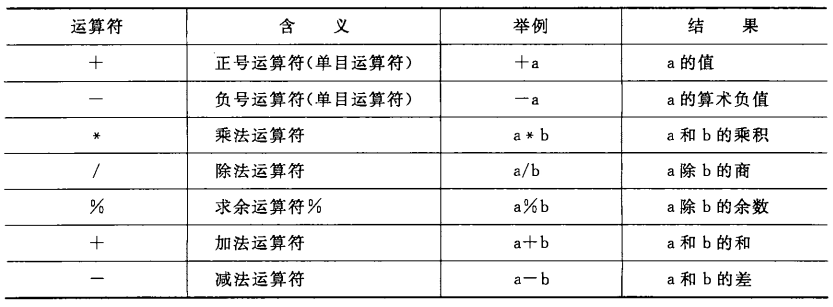

[TOC]

# 第3章 顺序程序设计

---
## 3.1 顺序程序设计举例

- [例3.1](./examples/3.1.c)
- [例3.2](./examples/3.2.c)

--- 
## 3.2 数据的表现形式及其运算

### 3.2.1 常量和变量

> 在高级语言中，所有数据要么是常量，要么是变量。

- 常量：程序运行过程中，其值不能被改变的量。
  - 分类：
    - 整型常量（如 1000， 12345， 0， -345）
      - 数制
        - 八进制（以 0 开始，例如 0123）
        - 十六进制（以 0x 或 0X 开始，例如 0x1a）
        - 十进制（以非 0 的数字开始，例如 123）
      - 后缀
        - L 或 l 表示长整型（为了便于阅读，建议使用 L）
      - > 注：这里的常量就是编码过程中直接写在代码中的数值。
    - 实型常量
      - 数制：只采用十进制形式
      - 表示形式：
        - 十进制小数形式（如 123.456, 0.345, -56.78, 0.0, 12.0）
        - 指数形式（如 12.34e3, -346.87e-25, 0.145E25）
          - > e 或 E 之前必须有数字，且 e 或 E 之后必须为整数
      - > 实型存在==舍入误差==。
    - 字符常量
      - 普通字符：用==单引号==括起来的==一个字符==（如 'a', 'Z', '3', '?'）
        - > 字符常量存储在计算机存储单元中时，并不是存储字符本身，而是存储其对应的 ASCII 码。
      - [转义字符](./补充_常用的转义字符及其作用.md)：以字符 \ 开头的字符序列
    - 字符串常量：用==双引号==括起来的==若干个字符==（如 "boy", "123"）
      - > 注：字符串常量末尾会默认存放一个 '\0' 字符作为字符串常量的结束标志（占用的内存字节数等于字符串中的字符数加 1）。
    - 符号常量：用 #define 指令指定用一个符号代表一个常量（如 #define PI 3.14）
      - 原理：预处理器把所有 PI 替换为 3.14。
      - 优点：
        - 含义清楚，易读易理解；
        - 若程序中多处用到同一个常量时，可以“一改全改”。
      - > 符号常量只是一个临时符号，==不占内存==。

- 变量：程序运行期间，其值可以被改变的量；代表一个有名字的、具有特定属性的存储单元。
  - 注意：
    > - 变量必须先定义，后使用;
    > - 在对程序进行编译链接时，由==编译系统==为每一个变量分配对应的内存地址；
    > - 从变量中取值，实际上是通过变量名找到相应的内存地址（编译器知道这个地址），然后从该内存存储单元中读取数据。

- 常变量：（如 const int a = 3;）
  - 注意：
    > - 由 C 99 标准引入；
    > - 常变量与常量的异同是：常变量具有变量的基本属性（有类型，占存储单元，值不允许被修改--编译器保证）；
    > - ==有了常变量以后，可以不必多用符号常量==。

### 3.2.2 数据类型

> 所谓类型，就是对数据分配存储单元的安排，包括存储单元的长度（占多少字节）以及数据的存储形式。不同的类型分配不同的长度和存储形式。

- 数据类型
  - 基本类型：（不能再分解为其他类型）
    - 整型类型
      - 基本整型（int）
      - 短整型（short int）
      - 长整型（long int）
      - \* 双长整型（long long int）
      - 字符型（char）
      - \* 布尔型（bool）
    - 浮点类型
      - 单精度浮点型（float）
      - 双精度浮点型（double）
      - 复数浮点型（float_complex, double_complex, long long_complex）
  - 枚举类型（enum）
  - 空类型（void）
  - 派生类型
    - 指针类型（*）
    - 数组类型（[]）
    - 结构体类型（struct）
    - 共用体类型（union）
    - 函数类型

> - 注意：根据一些特性，可以将上述数据类型进行分组
>   - 算数类型：值为数值
>     - 基本类型
>     - 枚举类型
>   - 纯量类型：值用数字表示
>     - 算数类型
>     - 指针类型
>   - 组合类型
>     - 数组类型
>     - 结构体类型
 
### 3.2.3 整型数据

- 整型数据的分类
  - 基本整型（int）
  - 短整型（short）
  - 长整型（long int）
  - 双长整型（long long int）
- 整型数据的存储
  - 补码形式存放在内存单元中
- signed 与 unsigned 修饰整型数据
  - signed: 有符号整型（默认，可省略）
    - > 对于有符号整型，第一个二进制位代表符号位（0 正；1 负）
  - unsigned：无符号整型

> - 注意：
>   - 补码：
>     - 正数的补码是该数的二进制形式；
>     - 负数的补码是该数绝对值的二进制形式按位取反（包括符号位）再加 1。
>   - 整型数据的大小
>     - C 99 标准不做统一规定，而是由编译器自行决定
>     - C 99 标准要求：sizeof(short) <= sizeof(int) <= sizeof(long) <= sizeof(long long)

### 3.2.4 字符型数据

> C 99 把字符型数据作为整数类型的一种。

- 字符与字符代码
  - ASCII 的基本集包括了 127 个字符；
  - 大写字母 'A' 的 ASCII 代码是十进制数 65；
  - 小写字母 'a' 的 ASCII 代码是十进制数 97；
  - > 大写字母和小写字母之间相差 32，也就是第 6 个二进制位。

- 字符变量（char）
  - > signed 和 unsigned 也可以修饰 char，表示一字节整型变量（对于负整数，不再代表一个字符）。C 标准没有规定默认的 char 是 signed 还是 unsigned，而是由具体的编译器决定。

### 3.2.5 浮点型数据

> - 在 C 语言中，实数是以指数形式存放在存储单元中的。
> - 由于小数点的位置可以浮动，所以实数的指数形式称为**浮点数**。
> - 规格化的指数形式：小数点前的数字为 0，小数点后第一位数字不为 0。有一个实数只有一个规范化的指数形式。

- 浮点型数据的分类
  - 单精度浮点型（float）
  - 双精度浮点型（double）
  - 长双精度浮点型（long double）
> - 浮点型数据的存储：数符 + 小数部分 + 指数部分
> - 小数部分、指数部分占用多少 bit 由编译器决定（参考 IEEE 754 标准）。

### 3.2.6 怎样确定常量的类型

> - 常量也有类型。
> - 在程序中出现的**常量**是要存放在计算机中的存储单元中的，因此需要确定存储空间的大小，存储方式。

- 字符常量：单引号括起来的单个字符或转义字符；
- 整型常量：不带小数点的数值。
  - 编译器会根据具体的常量值决定选择的整型数据类型。
  - > 也可以通过在整数末尾添加 L 或 l 表示长整型，从而显式告知编译器应选取的整型数据类型。
- 浮点型常量：以小数形式或指数形式出现的实数。
  - C 编译系统把浮点型常量都按双精度（double）处理。
  - > 也可以通过在浮点数末尾添加 F 或 f 表示单精度浮点型；添加 L 表示长双精度浮点型。

> 使用常量给变量赋值时，如果常量类型与变量类型不匹配，会有可能导致精度损失（例如 float a = 3.14），此时，编译器会发出 “警告”。

### 3.2.7 运算符和表达式

- 基本的算数运算符
  - 
  > - 两个实数相除的结果是双精度实数；
  > - 两个整数相除的结果是整数（直接舍去小数部分）；
  >   - 如果除数或被除数中有一个为负值，则舍入方向是不一定的（具体由编译器决定，多采用向零靠拢）。
  > - % 运算符的操作数必须为整数，结果也是整数；
  > - 除了 % 运算符以外的运算符的操作数可以是任何**算数类型**。

- 自增、自减运算符
  > - 注意区分先增和后增 (++i 和 i++ 或 --i 和 i--)；
  > - 自增、自减运算符只能用于变量（不能用于常量或表达式）。

> 注：关于算术表达式请[参考这里](./补充_C语言中的重要概念.md#算数表达式)

- 不同类型数据间的混合运算
  - \+, \-, \*, \/ 运算的两个数中有一个为 float 或 double 型，结果为 double 型。
    > - 系统将 float 型转换为 double 型，再进行计算。
  - 如果 int 型与 float 或 double 型进行运算，先把 int 和 float 都转换为 double，再进行计算，结果为 double 型。
  - 字符型与整型进行计算，即把字符型对应的 ASCII 码与整型进行计算。
  - 字符型与实型进行计算，先把字符型对应的 ASCII 码转换为 double 型，再进行计算，结果为 double 型。
  - > 以上转换均为==隐式转换==（编译系统自动完成，用户无需过问）。

- 强制类型转换运算符
  - 一般形式：（类型名）（表达式）
  - 例如：
    - (double)a;
    - (int)(x + y);
  - > 注：在强制类型转换时，会得到一个所需类型的中间临时数据，而不会对原始变量的类型产生影响。

- C 运算符（参考[这里](./补充_运算符的优先级和结合性.md)）

---
## 3.3 C语句

### 3.3.1 C语句的作用和分类

- C语句的作用：向计算机系统发出操作指令，要求执行相应的操作。
  - 一个 C 语句经过编译后产生若干条机器指令；
  - 声明部分不是语句，它不产生机器指令，只是对有关数据的声明。

> C语言的语句可以分为5类，分别是：
> - 表达式语句；
> - 空语句；
> - 复合语句；
> - 控制语句；
> - 函数调用语句。
> 下面将逐一介绍。

### 3.3.2 最基本的语句--赋值语句

- [例3.4](./examples/3.4.c)

- 赋值运算符（即等号 “=”）
  - 作用：将一个数据赋给一个变量。
- 复合的赋值运算符
  - 作用：执行指定的运算，并把运算结果赋给一个变量；
  - 例如：a += 3；
  > - 注1：凡是二元（二目）运算符，都可以与赋值运算符一起组合成复合运算符；
  > - 注2：其目的在于 1）精简程序；2）提高编译效率。
- 赋值表达式
  - 一般形式：变量 = 表达式
    - 由复制运算符将一个变量和一个表达式连接起来的式子（末尾没有分号，所以仍然是表达式）
  - 作用：先执行表达式右边的计算功能，然后执行赋值功能；
  - > 赋值运算符的左侧必须为==可被修改的“左值”==。

- ==赋值过程中的类型转换==
  - 若赋值运算符两侧的类型==一致==，则无需转换，直接赋值即可；
  - 若赋值运算符两侧的类型==不一致==，类型转换==由系统自动进行==，规则为：
    - 将浮点型数据赋值给整型变量：先对浮点数取整（直接舍弃小数部分），然后赋予整型变量；
    - 将整型数据赋值给单、双精度浮点型变量时：数值不便，但以浮点型形式存储在变量中；
    - 将双精度浮点型赋值给单精度浮点型时：先将双精度转换为单精度，然后保存在单精度变量中（注意双精度浮点型数值的大小不能超过单精度浮点型所能表示的范围）；
    - 将单精度浮点型赋值给双精度浮点型时：数值不便，直接按照双精度形式保存即可；
    - 将一个==占字节多==的整型数据赋值给一个==占字节少==的整型变量（或字符变量）时，只将其低字节原封不动地送到被赋值的变量。
  - > 总结：==整型数据之间赋值，按存储单元中的存储形式直接传送；实型数据之间以及整型与实型之间的赋值，是先进行类型转换，然后再进行赋值==。
  - > 注：C 语言允许不同类型数据之间进行赋值，但这常常会出现数据的失真，并且编译系统==不会提示==（不属于语法错误）。

- 赋值表达式和赋值语句
  - 赋值表达式末尾没有分号；
  - 赋值语句末尾必须有分号；
  - ==一个表达式可以包含一个或多个表达式==（包括赋值表达式），但绝对不能包含语句（包括赋值语句）。
  
- 变量赋初值
  - 对几个变量赋予同一个初值
    - 正确写法：int a = 3, b = 3, c = 3;
    - 错误写法：int a = b = c = 3;
    - 原因：一般变量初始化不是在编译阶段完成的（只有在静态存储变量和外部变量的初始化是在编译阶段完成的），而是在程序运行时执行本函数时赋予初值的，==相当于执行一个赋值语句==。

---
## 3.4 数据的输入输出

### 3.4.1 输入输出举例

- [例3.5](./examples/3.5.c)

### 3.4.2 有关数据输入输出的概念

- 输入输出是以计算机主机为主体而言的：
  - 从计算机向输出设备输出数据称为输出；
  - 从输入设备箱计算机输入数据称为输入。
- C 语言本身不提供输入输出语句
  - 输入和输出操作是由 C 标准库函数中的函数实现的；
  - 这样可以使 C 语言编译系统简单精炼，因为将语句翻译成二进制的指令是在编译阶段完成的，没有输入输出语句就可以避免在编译阶段处理与硬件有关的问题，从而简化编译系统，使编译系统的通用性更强，可移植性更好。
  > - 不同的编译系统所提供的函数库中，函数的数量、名字和功能是不完全相同的。
  > - 有些通用的函数（如 printf 和 scanf 等），各种编译系统都有提供，因而成为各种系统的==标准函数==。
- #include 预处理指令
  - 用来引用指定的头文件；
  - 在进行==预处理==时，系统使用被引用头文件中的内容取代本行的 #include 指令；
  - #include \<\>：指示编译系统从存放 C 编译系统的子目录中去寻找所包含的文件，为==标准方式==；
  - #include \"\"：指示编译系统先在当前目录中寻找要包含的文件；如果找不到，再按标准方式查找。
    > - 也可以在双引号中写出文件路径，例如 #include "C:\temp\demo.h"

### 3.4.3 用printf函数输出数据

关于 printf 函数的使用参考[这里](./补充_printf与scanf.md/#printf())

### 3.4.4 用scanf函数输入数据

关于 scanf 函数的使用参考[这里](./补充_printf与scanf.md/#scanf())

### 3.4.5 字符数据的输入输出

- 用 putchar 函数输出一个字符
  - [参考这里](./补充_putchar与getchar.md/#putchar())

- 用 getchar 函数输入一个字符
  - [参考这里](./补充_putchar与getchar.md/#getchar())