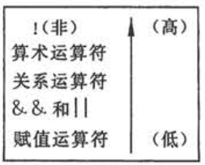

[TOC]

# 第4章 选择结构程序设计

> 根据是否满足某个条件来决定是否执行指定的操作任务；或者从给定的两种或多种操作选择其一执行。

---
## 4.1 选择结构和条件判断

- C 语言有两种选择语句：
  - if 语句
    - [例4.1](./examples/4.1.c)：用 if 语句实现双分支选择结构。
  - switch 语句

---
## 4.2 用if语句实现选择结构

### 4.2.1 用if语句处理选择结构举例

- [例4.2](./examples/4.2.c)
- [例4.3](./examples/4.3.c)

### 4.2.2 if语句的一般形式

- 一般形式：
  > if (表达式) 语句1
  > [else 语句2]
- 常用形式（3种）：
  - > if (表达式) 语句1
  - > if (表达式) 语句1
    > else 语句2
  - > if (表达式1) 语句1
    > else if (表达式2) 语句2
    > ...
    > else if (表达式n) 语句n
    > else 语句n+1

> - 注1：如果发现内嵌语句结束（出现分号），还要检查其后有无 else
>   - 如果无 else，就认为整个 if 语句结束；
>   - 如果有 else，则把 else 字句作为 if 语句的一部分。
> - 注2：else 子句不能作为语句单独使用（必须是 if 语句的一部分）。

---
## 4.3 关系运算符和关系表达式

> 比较符（或称比较运算符）称为**关系运算符**。

### 4.3.1 关系运算符及其优先次序

- C 语言提供 6 种关系运算符：

- > 注：
  > - 关系运算符的优先级==低于==算数运算符；
  > - 关系运算符的优先级==高于==赋值运算符。

### 4.3.2 关系表达式

- 关系表达式：用关系运算符将两个数值或数值表达式连接起来的式子；
  - 表达式的值为**逻辑值**，即“真”（用 1 表示）或“假”（用 0 表示）。

---
## 4.4 逻辑运算符和逻辑表达式

> 逻辑表达式：用逻辑运算符将==关系表达式==或其他==逻辑量==连接起来的式子。

### 4.4.1 逻辑运算符及其优先次序

- 三种逻辑运算符：与（AND: &&），或（OR: ||），非（NOT: !）
  - 
  > 注：“&&” 和 “||” 是双目运算符；“！”是单目运算符。

- 优先次序
  - 

### 4.4.2 逻辑表达式

- 逻辑表达式
  - 运算结果不是 0（“假”） 就是 1（“真”）；
  - 参与逻辑运算的运算对象可以是 0 （“假”）或任何非 0 （按“真”对待）的数值。
- 逻辑运算的真值表
  - 
  > 注：短路原则 -- 在逻辑表达式的求解中，并不是所有的逻辑运算都被执行。

### 4.4.3 逻辑型变量

- 逻辑型变量
  - C 99 增加的数据类型，类型符为 ==_Bool==；
  - 用来将**关系运算**和**逻辑运算**的结果保存到一个逻辑型变量中；
  - 如果 #include <stdbool.h>，那么可以使用 ==bool== 类型符和逻辑型变量 ==true==, ==false==。

---
## 4.5 条件运算符和条件表达式

- 条件运算符
  - 一般形式：
    - 表达式1 ? 表达式2 : 表达式3
  - 执行顺序
    - 先求解表达式1的值
      - 若为真（非 0），则求解表达式2的值，并把表达式2的值**作为条件表达式的值**；
      - 否则，求解表达式3的值，并把表达式3的值**作为条件表达式的值**。
  - 优先级
    - 条件运算符优先于赋值运算符；
    - 条件运算符的优先级低于关系运算符和算数运算符。
  - [例4.4](./examples/4.4.c)

---
## 4.6 选择结构的嵌套

- 一般形式
  - 
> 注：
> - else 总是与它==上面==的==最近==的未配对的 if 配对；
> - 可以通过加==花括号==来确定配对关系。

---
## 4.7 用switch语句实现多分支选择结构

- [例4.7](./examples/4.7.c)

- 一般形式
  - 
> 注：
>   - switch 后面括号内的 “表达式”，其值的类型应为整数类型（包括字符型）；
>   - 语句体内，case 关键字可以有多个；default 关键字最多一个；
>     - case 后面必须跟一个==常量==（或常量表达式），且每个常量必须==互不相同==；
>     - 各个 case 标号只起标记作用，出现次序不影响执行结果；
>     - 在 case 字句中可以包含一个以上执行语句，但可以不用花括号括起来形成语句块（括起来也没问题），程序会自动执行本 case 标号后面所有的语句；
>     - 可以没有 default。
>   - 如果在各 case 字句中没有 break 语句，将连续执行；
>     - 多个 case 标号可以共用一组执行语句。

补充：
  - 编译器会根据 case 后面的常量优化匹配顺序（达到二分查找的效率）；
  - 因此，如果我们在写 if...else if...else if...else 语句时，虽然使用的是变量，但是也可以根据统计规律调整指令的先后顺序，从而提高代码的执行效率。

## 4.8 选择结构程序综合举例

（本节全是例题讲解，故略）