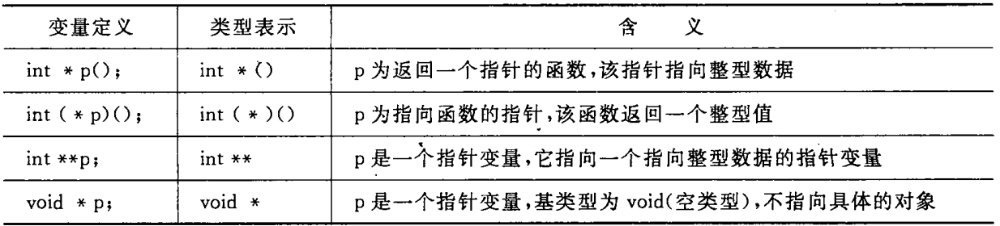

[TOC]

# 第8章 善于利用指针

> 正确而灵活地运用指针，可以使程序简洁、紧凑、高效。
> 不掌握指针，就是没有掌握 C 的精华。

---
## 8.1 指针是什么

> - 背景
>   - 系统会给程序中的变量分配内存单元，以存放变量中的数据；
>   - 在分配内存单元时，会根据变量类型，分配一定长度的空间（一个或多个内存单元）；
>   - 每个内存单元（字节）都有一个编号，即该内存单元的==地址==。

- 指针：一个变量的内存地址就是该变量的指针；
- 指针变量：用来存放指针的变量，其值是个内存地址；
  - 通过指针变量，可以==间接访问==一个变量，具体过程为：
    - 从指针变量中得到内存单元的地址；
    - 根据内存单元的地址，找到该内存单元；
    - 取出保存在内存单元中的数据。

---
## 8.2 指针变量

### 8.2.1 使用指针变量的例子

- [例8.1](./examples/8.1.c)

### 8.2.2 怎样定义指针变量

- 定义指针变量的一般形式：类型名 * 指针变量名；
  - 定义指针变量时可以同时对其进行初始化，例如: int * pInt = &a;  // int a = 10;
  - 类型名：指定此指针变量可以指向的变量的类型
    - 指针变量中存储的是变量的起始地址，也就是变量占用的第一个内存单元的地址；
      > 指针的类型表示的是其指向的数据的类型；指针的值表示的是其指向的数据在内存中的地址。因此，一个指针所占用的内存空间与其指向的数据的类型无关，而与运行程序的计算机的物理结构有关。
    - 而数据的存储往往占用多个字节（例如 int 占用4字节）；
    - 因此，需要通过类型名告知编译系统指针变量指向的数据占用了多少个字节（以及这块内存中数据的排布方式）。
  - > 综上：指针变量的含义包括两个方面，一是以存储单元编号表示的地址；二是指向的存储单元的数据类型（包括类似于 printf("%d"), scanf("%f")中的格式控制字符，都是在告知编译器如何看待指定的内存地址）。
  - > 指针变量中只能存放地址（即指针）。

### 8.2.3 怎样引用指针变量

- 给指针变量赋值：p = &a;  // int * p; int a = 10;
- 引用指针变量指向的变量：printf("%d", *p);
- 引用指针变量的值（即指针、地址）：printf("%o", p);

> - 重点就是两个运算符
>   - 取地址运算符（&）
>   - 指针运算符（又称间接访问运算符，*）

- [例8.2](./examples/8.2.c)

### 8.2.4 指针变量作为函数参数

> 指针类型可以作为函数的参数，
> 其作用是将一个==变量的地址==传送到另一个函数中。

- [例8.3](./examples/8.3.c)

- 可以猜测，指针类型是函数的形参；
- 指针变量作为实参，是==按值==传递给被调用函数的，因此
  - 如果在被调用函数中修改的是指针变量的值（即地址），那么不会对原函数中指针指向的数据产生影响；
  - 如果在被调用函数中修改的是指针指向的数据，那么就会影响到原函数中指针指向的数据。
> 需要注意的是，被调用函数从原函数那里得到的指针所指向的数据的==生命周期==需在函数执行期间有效。

---
## 8.3 通过指针引用数组

> 这一节的内容是非常重要的，需要好好地仔细理解。

### 8.3.1 数组元素的指针

- 数组元素的指针：就是==数组元素==的地址;

> 在 C 语言中，数组名代表数组中==首元素的地址==（不代表整个数组），因此，下面两个语句等价
> - p = &a[0];  // int * p; int a[10];
> - p = a;

- 在定义指针变量时可以对它进行初始化
  - int * p = &a[0]  // int a[10];
  - int * p = a;
  - > 上面两句等价。

### 8.3.2 在引用数组元素时指针的运算

> 指针就是地址；
> 对地址进行乘和除的运算是没有意义的;
> ==在一定条件下==允许对指针进行加和减的运算。
>  - “在一定条件”下指的是：当指针指向数组元素的时候。

- 当指针指向数组元素时，可以对指针进行以下运算
  - 加一个整数（用 + 或 +=），如 p+1
  - 减一个整数（用 - 或 -=），如 p-1
  - 自加运算，如 p++, ++p
  - 自减运算，如 p--, --p
  - 两个指针相减，如 p1-p2（p1 和 p2都==指向同一个数组中的元素==时才有意义）
  > - 实际的运算过程
  >   - 运算的结果仍然是地址
  >   - p + n，等价于 p + n * sizeof(pointer_type):
  >     - p 为指向特定数据类型的指针（由编译器根据定义指针式指定的基类型确定）；
  >     - n 为自然数；
  >     - 例如：p+1不是将 p 的值加 1，而是加上一个数组元素所占用的字节数。

- ==非常重要：==
  - 在编译时，对于数组 a 中的数组元素 a[i] 就是按 *(a + i) 处理的；
    - a 表示数组的首元素的地址；
    - 所以，a + i 表示数组中第 i 个元素的地址；
    - 所以 *(a + i) 表示第 i 个元素 a[i]。

### 8.3.3 通过指针引用数组元素

- 引用数组元素的方法
  - 下标法
    - 例如：a[i]（参见第6章）
  - 指针法
    - 例如：*(a + i), *(p + i)
      - 其中 a 是数组名，p 是指向数组元素的指针变量，i 是 a 中元素的下标。
    - 优点：目标程序质量高（占内存少，运行速度快）；对比 a[i]、*(a + i) 和 *p
      - a[i] 和 *(a + i) 的执行效率相同（两者等价）;
      - *p 的执行效率最高（与 *(a + i) 相比，指针已经提前算好，访存前不需要再次计算）。
  - [例8.6](./examples/8.6.c)

- 在使用指针变量指向数组元素时
  - 可以通过改变==指针变量==的值（也就是地址）指向不同的元素；
  - > ==数组名==代表数组元素的首地址，是==指针型常量==，其值不可改变。
  - 要注意指针变量的当前值（确保当前值有效），[例8.7](./examples/8.7.c)；
  - 指针变量也可以带下标，例如 p[i];  // int * p = a;
    - 这种方法依赖于 p 的==当前值==。例如，int * p, a[10];
      - p = a, 则 p[i] = a[i];
      - p = a + 3，则 p[i] = a[3 + i]。
    - 所以这种方法易出错，建议少用。

- 使用指针引用数组元素的==技巧==
  - p++; *p;
    - p 先指向下一个元素，然后引用该元素。
  - *p++;
    - 先引用 p 的值，然后 p 指向下一个元素。
  - *(++p);
    - p 先指向下一个元素，然后引用该元素。
  - ++(*p);
    - p所指向的元素的值加 1。

### 8.3.4 用数组名作函数参数

- 数组名作函数参数
  - 实参数组名代表该数组首元素的地址；
  - 形参用来接收从实参传递过来的数组首元素的地址。
  > - C 编译器都是讲形参数组名作为指针变量来处理的，例如
  > - fun(int arr[], int n)
  > - fun(int * arr, int n)
  > - 两者等价。
  > - 注：实参数组名代表一个固定的地址，即指针常量；形参数组名不是一个固定的地址，而是按指针变量处理（在函数执行期间，其值可以被改变）。
  - [例8.8](./examples/8.8.c)

- 如果有一个实参数组，要想在==函数==中改变此数组中的元素的值，实参与形参可以有以下几种对应关系
  - 形参和实参都用数组名;
  - 形参和实参都用指针变量;
  - 实参用数组名，形参用指针变量;
  - 实参用指针变量，形参用数组名。

### 8.3.5 通过指针引用多维数组

> 指针变量可以指向一维数组中的元素，也可以指向多维数组中的元素。

- 多维数组元素的地址
  - 以二维数组为例：int a[3][4] = {{1, 3, 5, 7}, {9, 11, 13, 15}, {17, 19, 21, 23}};
   - a 为二维数组名，代表二维数组==首元素的地址==，也是第 1 个一维数组==首元素的地址==；
   - a[0], a[1], a[2] 是三个==一维数组==，分别代表第 1、2、3 个一维数组==首元素的地址==；
     - a[0] 等价于 *(a + 0)，以此类推。
   - a[0][0], a[0][1], a[0][2], a[0][3] 是一维数组中的 4 个元素。
     - a[0][1] 等价于 *(a[0] + 1) 等价于 *( *(a + 0) + 1)。
   > - 上述只是 C 语言规定的语法，用来指导编译器生成对应的代码，而不是数学运算符的规律。
   > - 为了便于记忆，可以将多维数组的数组名看作==多级指针==。
  - 二维数组 a 的有关指针
    -  
  - > 不要把 &a[i] 简单的理解为 a[i] 元素的物理地址（因为可能并不存在 a[i] 这样一个实际的数据存储单元）。它只是一种==地址的计算方法==，能够得到第 i 行的首地址。
    > - &a[i] 和 a[i] 的值是一样的，但它们的含义是不同的。
  - [例8.11](./examples/8.11.c)

- 指向多维数组元素的指针变量
  - 指向数组元素的指针变量
    - [例8.12](./examples/8.12.c)
  - ==指向由 m 个元素组成的一维数组的指针变量==
    - [例8.13](./examples/8/13.c)
    > - int (* p)[4];  // 指向包含4个整型元素的一维数组
    > - int * p [4];  // 一个容量为 4 的指针数组
  - 用指向数组的指针作函数参数
    - [例8.14](./examples/8.14.c)
  > - 从这里可以看出在定义多维数组时，为什么只有第1维可省，而其它维度不可省。

> 数组与指针常常是紧密联系的，使用熟练的话可以使程序质量提高，编写程序方便灵活。

---
## 8.4 通过指针引用字符串

> 通过指针，可以更加灵活方便地使用字符串。

### 8.4.1 字符串的引用方式

- 字符串的引用方式
  - 用**字符数组**存储字符串
    - 通过==数组名和下标==引用字符串中的**一个字符**；
    - 通过==数组名和格式声明符%s==输出该字符串。
  - 用**字符指针变量**指向一个字符串常量
    - 通过==字符指针变量==引用字符串常量
      - [例8.17](./examples/8.17.c)
  - 对字符串中字符的存取，可以用下标法，也可以用指针法
    - [例8.18](./examples/8.18.c)
  - > C 语言中只有字符变量，没有字符串变量。

### 8.4.2 字符指针作函数参数

- 通过==传递地址==的方法，可以把一个字符串从一个函数“传递”到另一个函数
  - 在被调用的函数中可以改变字符串的内容；
  - 在主调用的函数中可以引用改变后的字符串。
  - [例8.20](./examples/8.20.c)
    - 用数组名作实参和形参；
    - 用字符型指针变量作实参，用数组名作形参；
    - 用字符型指针变量作实参和形参；
    - 用数组名作实参，用字符型指针变量作形参。
    > - 以上四种方式均可。

### 8.4.3 使用字符指针变量和字符数组的比较

- 字符指针变量和字符数组的==区别==
  - 区别1
    - 字符指针变量中存放的是地址，所以只需为字符指针变量分配一个存储单元；
    - 字符数组由若干个元素组成，每个元素中存放一个字符，所以需要为字符数组分配若干个连续的存储单元。
  - 区别2
    - 可以对字符指针变量赋值（也可以修改）；
    - 不能对数组名赋值（数组名为指针常量，不能修改）。
  - 区别3
    - 字符指针变量在初始化时被存入一个地址，例如 char * p = "I love China!";
    - 字符数组在初始化时被存入若干个字符，例如 char str[] = "I love China!";
  - 区别4
    - 字符指针变量指向的字符串常量中的内容不可以被修改；
    - 字符数组中的各个元素的值可以被修改。
  - 区别5
    - 可以通过字符数组名，用下标法和指针法引用一个字符数组中的元素；
    - 可以通过字符指针变量（指向字符数组的首元素），用下标法和指针法引用引用一个字符数组中的元素。
      - 如果字符指针变量没有指向字符数组的首元素，就不可以执行上述操作。
  - 区别6
    - 字符指针变量指向一个格式字符串后，可以代替 printf 函数中的格式字符串；
      - 还可以修改这个字符指针变量，使得 printf 变为==可变格式输出函数==。
    - 字符数组中存储格式字符串后，也可以代替 printf 函数中的格式字符串；
      - 但由于不能对字符数组整体赋值，导致无法方便地修改格式字符串。
    - > 综上，用指针变量指向字符串的方式更加方便。

---
## 8.5 指向函数的指针

> 本节对函数指针只做初步的介绍。

### 8.5.1 什么是函数指针

- 函数指针：在编译时，编译系统为**函数代码**分配一段存储空间，这段存储空间的==起始地址（又称入口地址）== 称为这个函数的指针。

### 8.5.2 用函数指针变量调用函数

- 调用函数的方法
  - 通过函数名调用（略）
  - 通过指向函数的指针变量调用
    - [例8.22](./examples/8.22.c)

### 8.5.3 怎样定义和使用指向函数的指针变量

- 定义函数指针变量
  - 一般形式：类型名 (* 指针变量名)(函数参数列表);
  > - 注1：
  >   - "*"指针变量名两侧的括号不能省略;
  >   - "*"与指针变量名结合表示指针变量名是个指针；
  >   - 再与后面的"()"结合表示是函数，合起来就是函数指针。
- 使用函数指针变量
  - 一般形式：类型名 (* 指针变量名)(函数参数列表);
  > - 注1：
  >   - 定义的函数指针变量，只能指向在定义时指定的类型的函数；
  >   - 在一个程序中，可以先后指向同类型的不同函数（与通过函数名调用函数相比，更加灵活）。
  > - 注2：
  >   - 通过函数指针变量调用函数前，必须先使该指针变量指向该函数；
  >   - 在给函数指针变量赋值时，只须给出函数名，而不必给出参数；
  >   - 用函数指针变量调用函数时，只须用（*p）代替函数名即可。
  > - 注3：
  >   - 函数指针变量不能进行算数运算。
- [例8.23](./examples/8.23.c)

### 8.5.4 用指向函数的指针作函数参数

> 函数指针变量的一个重要用途就是把函数的地址作参数传递到其他函数。
> 这种方法符合结构化程序设计方法原则，是程序设计中常使用的。

- [例8.24](./examples/8.24.c)

---
## 8.6 返回指针值的函数

> 一个函数可以返回指针类型的数据。

- 定义返回指针的函数
  - 一般形式：类型名 * 函数名(参数列表);
  - 注：在 “* 类型名” 两侧没有括号。

- [例8.25](./examples/8.25.c)
- [例8.26](./examples/8.26.c)

---
## 8.7 指针数组和多重指针

### 8.7.1 什么是指针数组

- 指针数组：即一个数组中的元素均为指针类型数据。
  - 一般形式：类型名 * 数组名[数组长度];
  - 使用场景：
    - 指向若干个不等长的字符串（如果使用二维数组，会浪费内存空间）。
  - [例8.27](./examples/8.27.c)

### 8.7.2 指向指针数据的指针

- 指向指针数据的指针（简称指向指针的指针，以二级指针为例）
  - 一般形式：类型名 **指针变量名;
  - 含义：一个指针变量，指向另一个指针变量（其值是另一个指针变量的地址）;
  - 例如：指针数组名就是一个指向指针的指针。
  - [例8.28](./examples/8.28.c)
  - [例8.29](./examples/8.29.c)
- 间址寻址
  - 指针变量：单级间址
  - 指向指针的指针：二级间址
  - > 可以延伸到多重指针（即多级间址）
    > - ==但很少超过二级==;
    > - 级数越多，越难以理解，容易产生混乱，出错机会也多。

### 8.7.3 指针数组作 main 函数的形参

- main 函数
  - 无参形式：int main() {...}
  - 有参形式：int main(int argc, char * argv[]) {...}
    - argc 和 argv 是从==命令行参数==传入；
    - argc 的值为命令行参数的个数；
    - argv 的值为各个命令行参数的的首地址（各个命令行参数均为字符串，第 0 个是命令名）;
    - 命令行的一般形式：命令名 参数1 参数2 ... 参数n
    - 例如：file1 China Beijing
      - 
    - > main 函数的形参不一定命名为 argc 和 argv，可以是任意名字（但习惯上这样命名）。

---
## 8.8 动态内存分配与指向它的指针变量

### 8.8.1 什么是内存的动态分配

- 变量的存储位置
  - 静态存储区
    - 例如：全局变量，静态的局部变量。
  - 栈区
    - 例如：非静态的局部变量。
  - 堆区
    - 用途：不必在程序的声明部分定义，而是根据需要随时开辟，不需要时随时释放。
    - 特点：==只能通过指针来引用==。

### 8.8.2 怎样建立内存的动态分配

> ==<stdlib.h>== 中的 4 个库函数

- malloc 函数
  - 函数原型：void * malloc(unsigned int size);
  - 作用：在内存的动态存储区中分配一个长度为 size 的==连续空间==；
  - 返回值：所分配区域的第一个第一个字节的地址（即首地址）；
    - 如果未能成功地执行（例如内存不足），则返回空指针（NULL）。
- calloc 函数
  - 函数原型：void * calloc(unsigned int n, unsigned int size);
  - 作用：在内存的动态存储区中分配 n 个长度为 size 的连续空间；
    - 例如：可以为一维数组开辟动态存储空间，n 为数组元素的个数，size 为每个元素的长度。
    - > 可见，n 个长度为 size 的连续空间是连在一起的。
  - 返回值：所分配区域的首地址；
    - 如果未能成功地执行，则返回 NULL。
- free 函数
  - 函数原型：void free(void * p);
  - 作用：释放指针变量 p 所指向的动态存储区的空间；
    - p 应为最近一次调用 malloc 或 calloc 函数时得到的函数返回值（尚未被释放）。
  - 返回值：该函数无返回值。
- realloc 函数
  - 函数原型：void * realloc(void * p, unsigned int size);
  - 作用：通过重新分配来改变之前通过 malloc 或 calloc 函数得到的动态存储区的空间的大小；
    - ==执行完成后，p 的值不变==。
  - 返回值：如果重新分配不成功，返回 NULL。

### 8.8.3 void 指针类型

> C 99 允许使用基类型为 void 的指针类型。
> void * 类型的变量，不指向任何类型的数据（指向数据的类型不确定）。

- [例8.30](./examples/8.30.c)

> 当把 void 指针赋值给不同基类型的指针变量时，编译系统会自动进行转换。
> 例如：
>  - int * p = (int *) malloc(5 * sizeof(int));
>  - int * p = malloc(5 * sizeof(int));
>  - 两者等价。

---
## 8.9 有关指针的小结

- 指针：就是地址；
- 指针变量：就是一个值为地址（指针）的变量；
- 指向：就是地址（通过地址可以访问其中的对象）；
  - void * 指向的地址没有类型。如果需要指向某类型的数据，需要对==地址==进行类型转换
    - 可以在程序中进行显式类型转换；
    - 也可以由编译系统自动进行隐式转换。
- 通过指针操作数组
  - 一维数组名代表数组的首元素的地址；
- 指针变量的类型及含义
  
  
- 指针运算
  - 加、减一个整数
  - 赋值
    - 只能是地址;
    - 不能把一个整数赋给指针变量。
  - 两个指针变量相减
    - 差为两个指针之间的元素的个数。
- 指针变量可以有空值
  - 表示不指向任何变量；
  - 用 NULL 表示指针为空。
- 指针的优点：
  - 提高程序效率；
  - 在被调用函数中改变主调用函数中变量的值；
  - 实现动态存储分配。
- 指针的缺点：
  - 容易出错；
  - 错误比较隐蔽，难以发现和排除。
