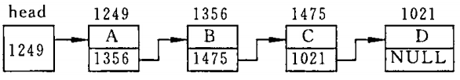

[TOC]

# 第9章 用户自己建立数据类型

> C 语言允许用户根据需要自己建立一些数据类型（也称构造类型），用它来定义变量。
> 构造类型可以分解成若干个“成员”或“元素”。每个“成员”都是一个基本类型或一个构造类型。

---
## 9.1 定义和使用结构体变量

### 9.1.1 自己建立结构体类型

- 结构体类型（在其他一些高级语言中被称为“记录”）
  - 一般形式：struct 结构体名 {成员表列};
    - 结构体名（又称“结构体标记”）：由用户指定，用来区别于其他结构体。
    - 成员表列（又称“域表”）：结构体的成员
      - 一般形式：类型名 成员名;
      > - 每个成员都是结构体中的一个域；
      > - 成员的命名规则与变量名相同;
      > - ==成员可以属于另一个结构体类型==。
  - 特点：
    - 由用户根据需要自己建立；
    - 由不同类型数据组成的组合型的数据结构;
    - 可以用来定义变量。

### 9.1.2 定义结构体类型变量

- 定义结构体类型变量的 3 种方法
  - 先声明结构体类型，再定义该类型的变量
    - 一般形式：struct 结构体名 变量名表列;
    - 例如：struct Student student1, student2;
      - 其中，Student 是已经声明过的结构体类型。
  - 在声明结构体类型的同时定义变量
    - 一般形式：struct 结构体名 {成员表列} 变量名表列;
      - > 变量名表列前面与声明结构体的方法一致。
    - 例如：
      ```C
        struct Student
        {
            int number;
            char name[20];
            char sex;
            int age;
        } student1, student2;
      ```
    - 注：实际编程时，结构体的声明与变量的定义一般是分开的，所以这种方式用的不多。
  - 不指定类型名而直接定义结构体类型变量
    - 一般形式：struct {成员表列} 变量名表列;
    - 注：该结构体类型无名，所以无法再定义更多变阿玲，所以这种方法用的不多。
- 说明
  - 结构体类型与结构体变量是不同的概念
    - 结构体类型：不分配内存空间，不能对其进行赋值、存取、运算；
    - 结构体变量：分配内存空间，可以进行赋值、存取、运算。
  - 结构体类型中的成员名可以与程序中的其他变量名相同
    - 但二者==不代表同一对象==。
  - 可以单独引用结构体变量中的成员（即“域”）。

### 9.1.3 结构体变量的初始化和引用

- 在定义结构体变量时，可以对它进行初始化（即赋予初始值）
  - 初始化列表是用花括号括起来的一些常量；
  - 这些常量==依次==赋给结构体变量中的各个成员。
  - [例9.1](./examples/9.1.c)
  - > C 99 标准允许对==某一成员==初始化。
    > 其他未被指定初始化的数值型成员被初始化为 0；字符型为 '\0'；指针型为 NULL。
- 引用结构体变量中的成员
  - 一般形式：结构体变量名.成员名
    - “.”：成员运算符（在所有运算符中的==优先级最高==）。
  - 注：
    - 不能企图输出结构体变量名来达到输出结构体变量==所有成员==的值的目的（只能分别输入和输出各个成员）;
    - 如果成员本身又属一个结构体类型，则要用若干个成员运算符，一级一级地找到最低一级的成员；
    - 对结构体变量的成员可以像普通变量一样进行各种运算（根据成员的类型决定可以进行的运算）；
    - ==同类的结构体变量可以互相赋值==；
    - 可以==引用结构体变量成员的地址==，也可以==引用结构体变量的地址==。
  - [例9.2](./examples/9.2.c)

---
## 9.2 使用结构体数组

### 9.2.1 定义结构体数组

- 结构体数组：每个数组元素都是一个结构体类型的数据。
  - 定义的一般形式：
    - 声明时结构体时定义结构体数组：struct 结构体名 {成员表列} 数组名[数组长度];
    - 使用声明过的结构体定义结构体数组：struct 结构体名 数组名[数组长度];
  - 初始化的一般形式：在定义数组的后面加上 **={初值表列};**
  - [例9.3](./examples/9.3.c)

## 9.2.2 结构体数组的应用举例

- [例9.4](./examples/9.4.c)

---
## 9.3 结构体指针

> 结构体指针：就是指向结构体变量的指针。
>  - 结构体变量的**起始地址**就是这个结构体变量的指针。

### 9.3.1 指向结构体变量的指针

- 指向结构体**对象**的指针
  - 可以指向结构体变量；
  - 可以指向结构体数组中的元素。
  - > 指针变量的基类型必须与结构体变量的基类型相同。
  - [例9.5](./examples/9.5.c)

> - 如果 p 指向一个结构体变量 stu（见[例9.5](./examples/9.5.c))，以下 3 种用法等价：
>   - stu.成员名（例如 stu.num）;
>   - (* p).成员名（例如(* p).num）;
>   - p->成员名（例如 p->num）;

### 9.3.2 指向结构体数组的指针

- [例9.6](./examples/9.6.c)

> - 注意：
>   - 支持对指针进行运算，运算规则基本与指向基本类型的指针相同，
>     - 执行 p++ 时（p 为结构体指针），p 的值增加了对应结构体变量的长度（其余运算类似）。
>   - 不能用结构体指针指向结构体数组元素的某一成员。

### 9.3.3 用结构体变量和结构体变量的指针作函数参数

- 将一个结构体变量的值传递给另一个函数（3 种方法）：
  - 用结构体变量的成员作参数
    - 用法同普通变量，属于“按值传递”；
  - 用结构体变量作实参
    - 属于“按值传递”；
  - 用指向结构体变量（或数组元素）的指针作实参
  - [例9.7](./examples/9.7.c)

---
## 9.4 用指针处理链表

### 9.4.1 什么是链表

- 链表
  - 示意图（单向链表）：
  - 说明：由**结点**串联而成，每个结点包括
    - 用户需要用的实际数据
    - 下一个结点的地址
      - 如果是**表尾**结点，则下一结点的地址为**NULL**
  - 结点的数据结构：
    ```C
    struct Student
    {
        int num;
        float sclre;
        struct Student * next;  // 关键：指向当前结构体类型的指针
    }
    ```

### 9.4.2 建立简单的静态链表

- 静态链表：所有结点都是在程序中定义的，不是临时开辟的，也不能用完后释放。
  - [例9.8](./examples/9.8.c)

### 9.4.3 建立动态链表

- 动态链表：在程序执行过程中，一个一个地开辟结点和输入各结点数据，并建立起前后相链的关系。
  - [例9.9](./examples/9.9.c)

### 9.4.4 输出链表

- > 前两节的代码"[例9.8](./examples/9.8.c), [例9.9](./examples/9.9.c)"中均包含了输出链表的操作

---
## 9.5 共用体类型

### 9.5.1 什么是共用体类型

- 共用体类型
  - 作用：用同一段内存单元存放不同类型的变量。
  - 定义的一般形式：union 共用体名 {成员表列} 变量表列;
  - 特点：
    - 共用体变量所占的内存长度等于==最长的成员的长度==

### 9.5.2 引用共用体变量的方式

> - 先定义，再引用；
> - 不能引用共用体变量，==只能引用共用体变量中的成员==。

### 9.5.3 共用体类型数据的特点

- 每一瞬间只能存放共用体成员中的==一个==（而不是同时存放几个）；
- 可以对共用体变量初始化，但初始化表中==只能由一个常量==；
  - 例：
    ```C
    union Data
    {
        int i;
        char ch;
        float f;
    } a = {16}, b = {.ch = 'j'};
    ```
- 共用体变量中起作用的成员是最后一次被赋值的成员；
- 共用体变量的地址和它的各个成员的地址都是==同一地址==；
- 不能通过共用体变量名直接得到一个值；
- 可以使用指向共用体变量的指针作为函数参数；
- 共用体类型可以是结构体类型的成员；反之依然成立；
- 可以定义共用体数组；数组可以是共用体的成员；
- 从 C 99 开始
  - 允许同类型的共用体变量相互赋值；
  - 允许共用体变量作为函数参数。

- [例9.11](./examples/9.11.c)

---
## 9.6 使用枚举类型

- 枚举：
  - 特点：其值只限于在花括号中列举出来的值的范围。
  - 声明枚举类型的一般形式：enum 枚举名 { 枚举元素列表 };
  - 定义枚举变量的一般形式：
    - enum 枚举名 { 枚举元素列表} 枚举变量名1, ..., 枚举变量名n;
    - enum 已声明的枚举名 枚举变量名1, ...，枚举变量名n;
  - 注：
    - 枚举名是可选的（可以不给出枚举名，而直接定义枚举变量）；
    - C 编译器对枚举类型的枚举元素按常量处理（枚举元素也称枚举常量）
      - 每个枚举元素代表一个整数，按照定义时的顺序默认从 0 开始；
      - 可以人为地指定枚举元素的整数值（只须在声明枚举类型时显示地指定）
        - enum Weekday {sun=7, mon=1, tue, wed, thu, fri, sat}
          - sun 的值为 7；
          - mon 的值为 1；
          - 以后的各个值顺序加 1，tue 为 2，sat 为 6。
      - 枚举元素可以引用和输出（结果是整数）
        ```C
        Weekday workday = mon;
        printf("%d", workday);
        ```
      - 枚举元素可以用来作判断比较（使用其对应的整数值进行比较）
        ```C
        if (workday == mon)...
        if (workday > sun)...
        ```
    - 
  - [例9.12](./examples/9.12.c)


---
## 9.7 用 typedef 声明新类型名

- 简单地用一个新的类型名代替原有的类型名
  - 例如：
    ```C
    typedef int Integer;  // 指定用 Integer 为类型名，作用与 int 相同
    typedef float Real;   // 指定用 Real 为类型名，作用与 float 相同
    ```
- 命名一个简单的类型名代替复杂的类型表示方法
  - 目的：简化编程，易于理解，从而提高编程效率。
  - 操作方法：==按定义变量的方式，把变量名换上新类型名，并且在最前面加上 “typedef” 即可。==
  - 例如：
    ```C
    // 命名一个新类型名，代表结构体类型
    typedef struct
    {
        int month;
        int day;
        int year;
    } Date;
    Date birthday, * pDate;

    // 命名一个新类型名，代表数组类型
    typedef int Num[100];
    Num a;

    // 命名一个新类型名，代表指针类型
    typedef char * String;
    String p, s[10];

    // 命名一个新类型名，代表指向函数的指针类型
    typedef int (* Pointer)();
    Pointer p1, p2;
    ```
  - 注：
    - 习惯上，把 typedef 声明的类型名的==第一个字母大写==，以便于系统提供的标准类型标识符相区别;
    - typedef 只是对已经存在的类型指定一个新的类型名，==没有创造新的类型==；
    - typedef 与 #define
      - 相同点：都可以用来指定**别名**；
      - 不同点：
        - typedef: 在编译阶段处理；
        - #define: 在预处理阶段处理，只是进行==简单的字符串替换（使用时需要特别注意，这里有坑）==。
    - 当不同源文件中用到同一个 typedef 命名的类型时，可以把所有用到的 typedef 名称声明==单独放在一个头文件中==，然后再需要用到的地方 #include 该头文件即可；
    - 使用 typedef 名称有利于程序的通用与移植。

