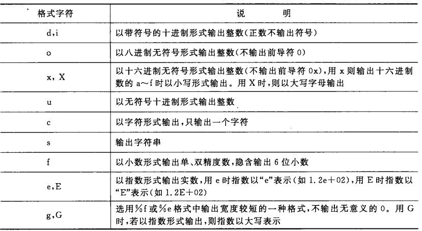
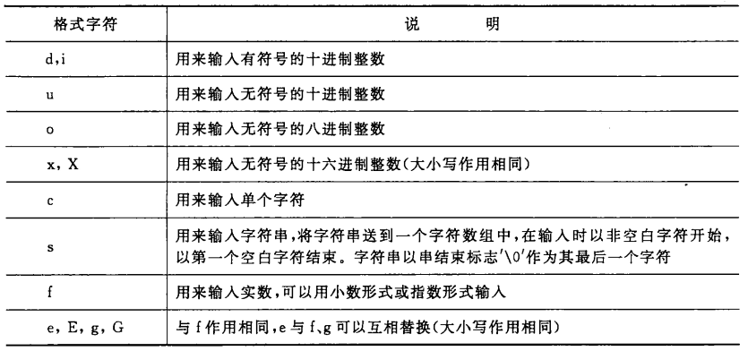
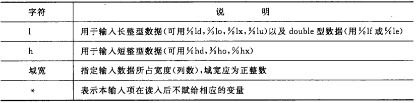

[TOC]

# printf 与 scanf

## printf()

> printf(): ==格式==输出函数，即根据数据的不同类型指定不同的格式。

- 一般形式：printf(格式控制，输出列表)；
  - 格式控制：双引号括起来的一个字符串，简称“格式字符串”
    - 格式声明：由 “%” 和**格式字符**组成，且总是以 “%” 字符开头；
    - 普通字符：在输出时会被**原样输出**。
  - 输出列表：可以是**常量**，**变量**，**表达式**。

- 格式字符

> 注：
> - 可以在 “%” 和格式字符之间用 “m.n” 形式指定**域宽**（m列）和保留的小数位数（n位小数，实型数据使用，整型不需要）；
> - 格式字符前面的字母 "l" 表示 "long"，如“ld”（long）， “lld”（long long）， “lf”（long double）；
> - 对于格式符 “c”，可以用来格式输出一个 0 ~127 范围内的整数，如果超出这个范围，则把数据==最后一个字节==的信息以字符形式输出；
> - 可以在 “%” 后面紧跟负号 “-”，用来控制==左对齐==输出（默认右对齐）；
> - 如果需要输出百分号 “%”，可以在**格式字符串**中连用两个百分号 “%”。

## scanf()

> scanf(): ==格式==输入函数。

- 一般形式：scanf(格式控制，==地址==列表)；
  - 格式控制：含义同 printf 函数；
  - 地址列表：可以是变量的==地址==，也可以是字符串的==首地址==。

- 格式字符

> 注1：可以把格式控制部分理解为一个正则表达式，格式声明部分匹配到的内容会按照指定的格式保存到对应的变量地址中；而普通字符直接被忽略;
> 注2：如果使用两个连续的空格作为普通字符，那么在对应的两个输入数据之间应该有两个或更多的空格字符；
> 注3：用 “%c” 格式声明输入字符时，空格字符和“转义字符”中的字符都作为有效字符输入；
> 注4：在输入数值数据时，两个数值之间需要插入空格（或通过普通字符指定的分隔符），以便系统能够区分两个数值；
> 注5：在输入数值数据时，如果输入空格、回车、tab 键或非法字符时，则认为该数据结束。