[TOC]

# [Diagrams](https://shd101wyy.github.io/markdown-preview-enhanced/#/diagrams)

## [Mermaid](https://github.com/mermaid-js/mermaid)

> 注：从配置中搜索'mermaid'，然后可以选择渲染时使用的主题

### [流程图](http://mermaid-js.github.io/mermaid/#/flowchart)
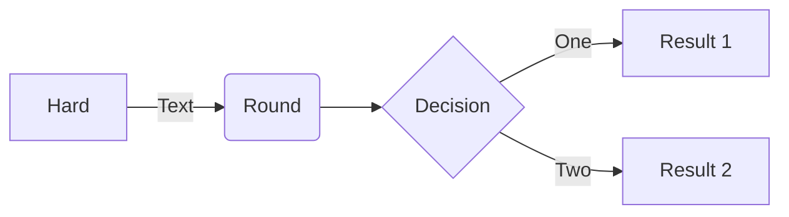

### [顺序图](http://mermaid-js.github.io/mermaid/#/sequenceDiagram)
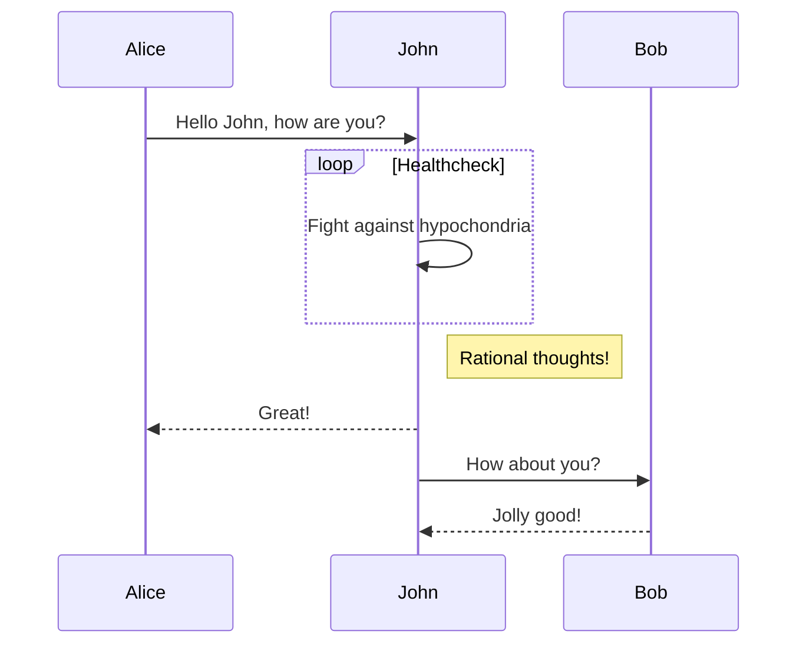

### [甘特图](http://mermaid-js.github.io/mermaid/#/gantt)
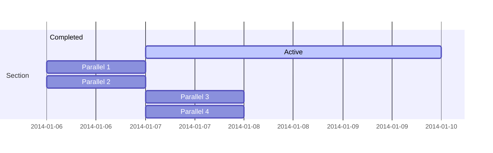

### [类图](http://mermaid-js.github.io/mermaid/#/classDiagram)
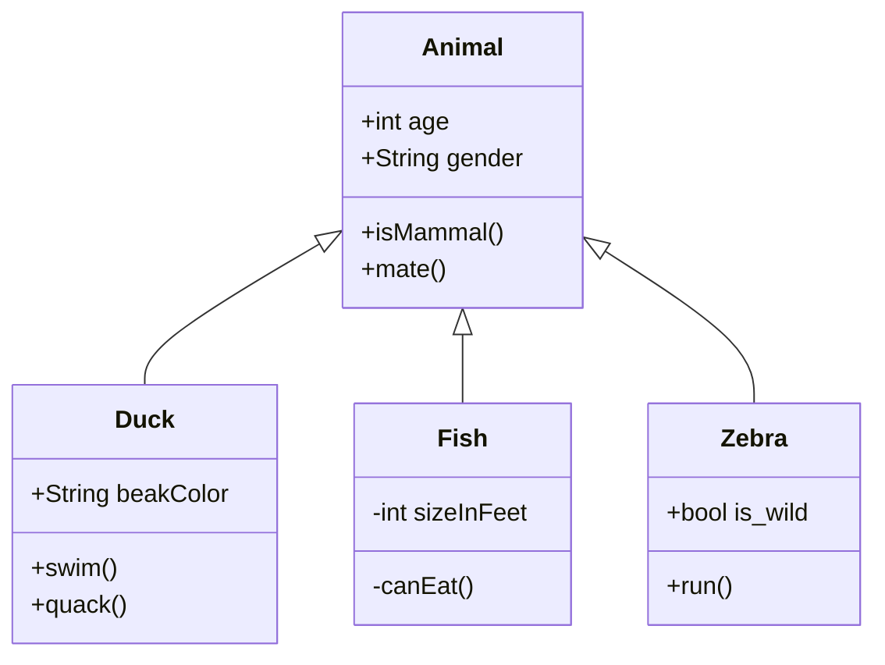

### [状态图](http://mermaid-js.github.io/mermaid/#/stateDiagram)
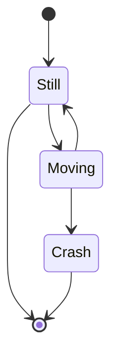

### [饼状图](http://mermaid-js.github.io/mermaid/#/pie)
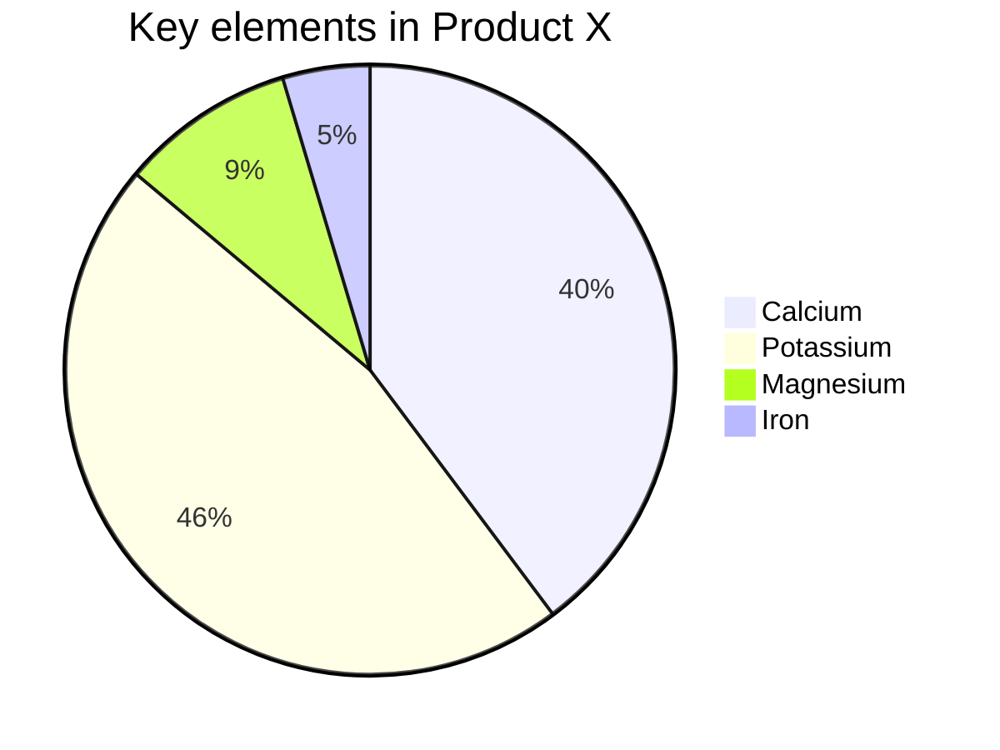

## [PlantUML](https://plantuml.com/zh/)

### [用例图](https://plantuml.com/zh/use-case-diagram)
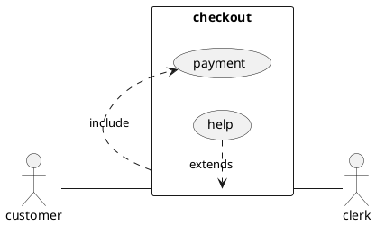

### [活动图](https://plantuml.com/zh/activity-diagram-legacy)
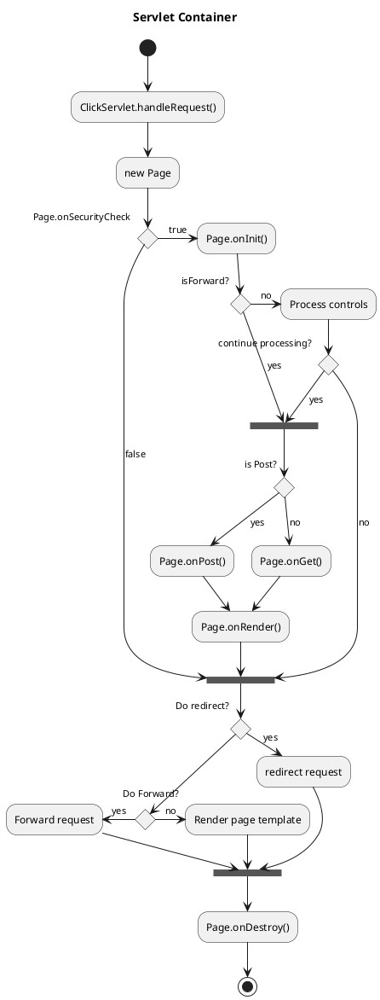

### [组件图](https://plantuml.com/zh/component-diagram)
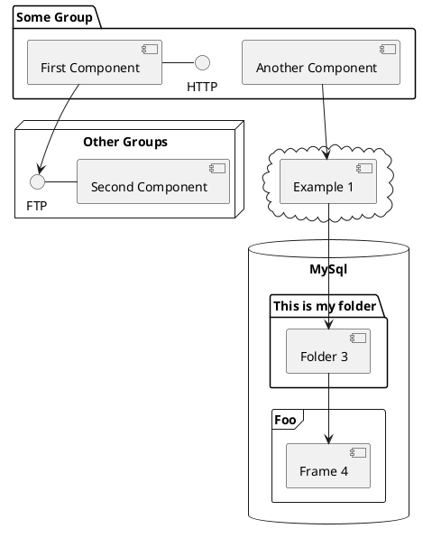

### [类图](https://plantuml.com/zh/class-diagram)
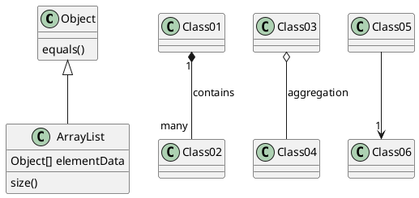

### [状态图](https://plantuml.com/zh/state-diagram)
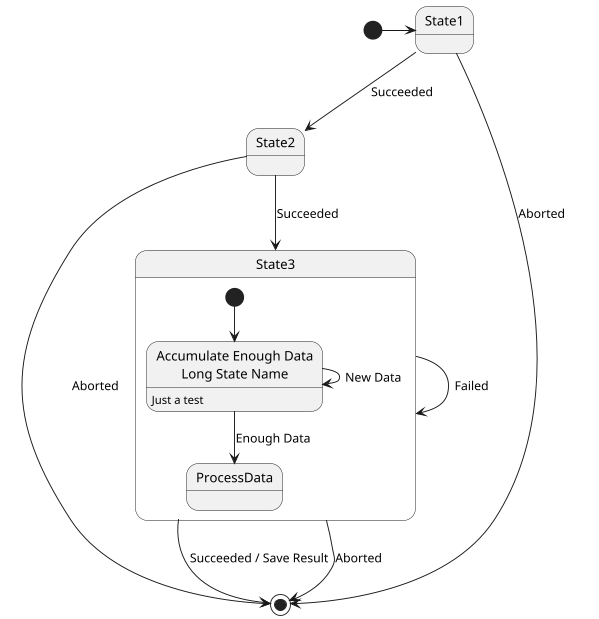

### [时序图](https://plantuml.com/zh/sequence-diagram)
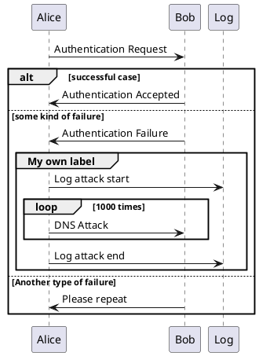