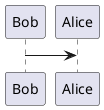

# Markdown things we want

## Prepare
- Visual Studio Code
- `markdown priview enhanced` extension for VSCode

## Catalogue

1. [Markdown Basic Syntax](./markdown_basic_syntax.md)
2. [Markdown Extended Syntax](./markdown_extended_syntax.md)
3. [Markdown Math](./markdown_math.md)

